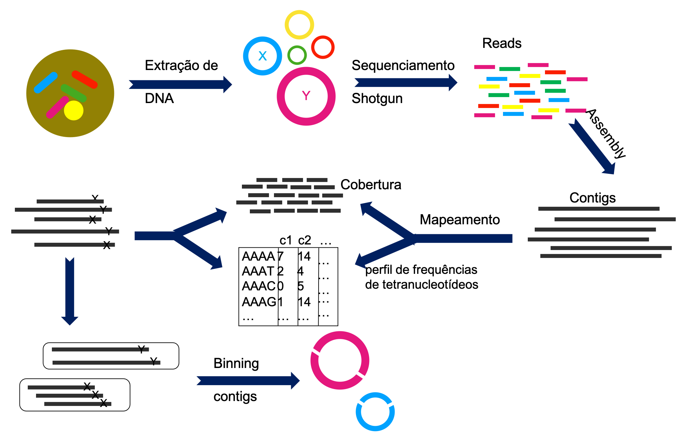
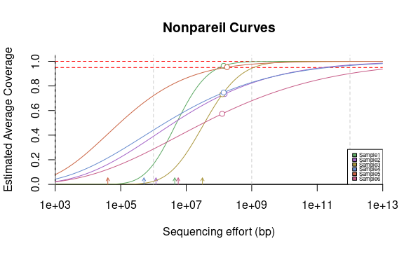
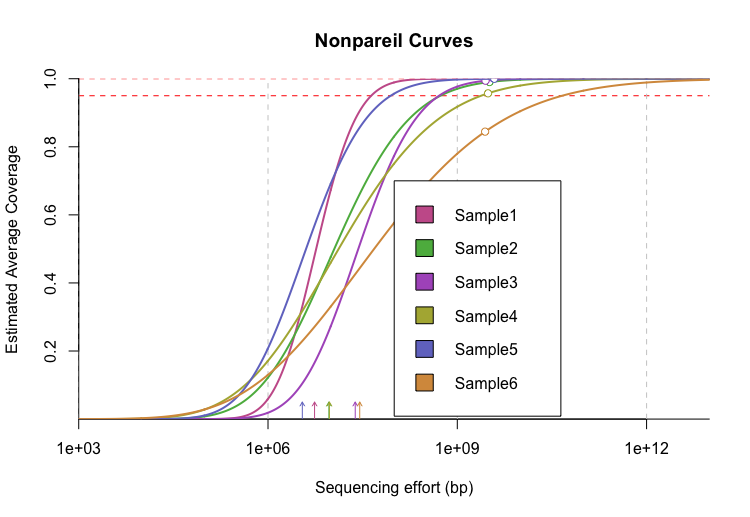
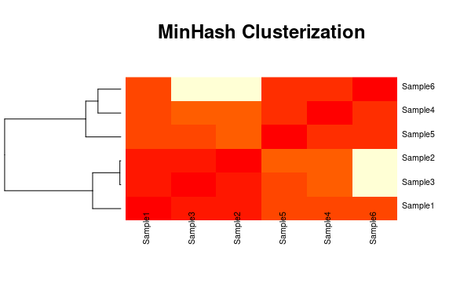
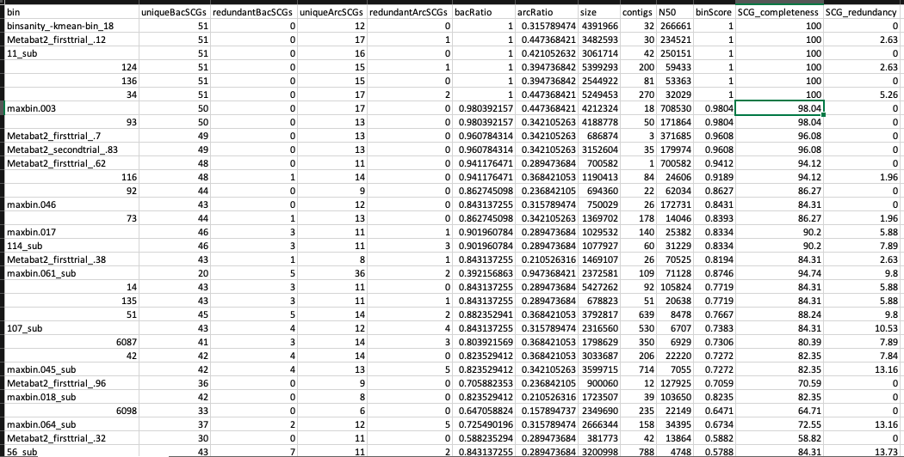
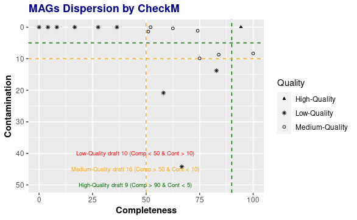

<!-- README.md is generated from README.Rmd. Please edit that file -->
<!-- badges: start -->


<!-- badges: end -->

# Recuperação de Genomas apartir de metagenomas- Binning! 

**Developer: MsC. Kelly Hidalgo**

Pipeline para reconstrução de genomas a partir de metagenomas, usando
várias ferramentas de *binning* e *DAS tools* para integrar os
resultados dos algoritmos de binning para calcular um conjunto otimizado
e não redundante de MAGs (*Metagenome Assembled Genomes*) de uma única
montagem.

------------------------------------------------------------------------

## Introdução

### Sequenciamento massivo de metagenomas

O sequenciamento massivo ou em larga escala de metagenomas, compreende a
extração do DNA total de uma amostra de qualquer ambiente ou tipo de
amostra (i.e. solo, agua, feces, esponjas marinas, tecidos vegetais,
etc) e o sequenciamento por uma técnica chamada *shotgun*. Onde o DNA
total é fragmentado em muitos pedacinhos, os quais são sequenciados
aleatoriamente, obtendo assim as chamadas *reads*, que são sequências
pequenas.


O *binning* é uma técnica bioinformática para reconstruir genomas a
partir de metagenomas. O processamento inclui as seguintes fases: **1)
Sequenciamento de metagenomas**, do qual vai se obter reads; **2)
Controle de qualidade das reads**, usando ferramentas como *Trimmomatic*
são filtradas as reads de baixa qualidade; **3) Montagem das reads**,
dos quais vão se obter contigs ou scafolds; **4) Mapeamento das reads**,
isto com o objetivo de saber a abundância e o origem de cada read
(informação necessária para a seguinte etapa); **5)** ***Binning***,
usando diferentes ferramentas/algoritmos (i.e. *Metabat2, MaxBin,
CONCOCT, BinSanity*) que clusterizam os contigs/scalfolds baseado em
diferentes características similares tais como: níveis de cobertura de
cada contig/scalfold, genes marcadores de cópia única, perfil de
frequências de tetranucleotídeos, formando os genomas reconstruidos
também conhecidos como *MAGs* ou *Bins*; **6) Controle de qualidade**,
compreende o uso de ferramentas bioinformáticas (i.e. *CheckM, DAStool*)
para á analise da qualidade de cada um dos bins gerados, em ítems como
completude e contaminação; **7) Anotação taxonômica** e **8) Anotação
funcional**

A continuação uma visão geral do processo de **Binning**



<style>
div.blue { background-color:#e6f0ff; border-radius: 5px; padding: 20px;}
</style>

<div class="blue">

> **O que vai encontrar aqui:**
>
> -   Controle de qualidade de sequenciamento shotgun
>
> -   Montagem de metagenomas
>
> -   Mapeamento de reads
>
> -   Reconstrução de genomas
>
> -   Anotação taxonômica e funcional de genomas

</div>

------------------------------------------------------------------------

# Ferramentas bioinformáticas

\*\*Antes de começar: Use o tutorial de
[Unix](https://github.com/khidalgo85/Unix) para aprender comandos
básicos em bash que serão muito úteis para este tutorial.

## Intalação Anaconda

É recomendável instalar Anaconda, pois é a forma mais fácil para
instalar as ferramentas bioinformáticas necessárias pro desenvolvimento
deste pipeline. Anaconda é uma distribuição livre e aberta das
linguagens *Python* e *R*, utilizada na ciência de dados e
bioinformática. As diferente versões dos programas se administram
mediante um sinstema de gestão chamado *conda*, o qual faz bastante
simples instalar, rodar e atualizar programas.
[Aqui](https://conda.io/projects/conda/en/latest/user-guide/install/index.html)
se encontram as instruções para a instalação de Anaconda.

Depois de instalado, *Anaconda* e o gestor *Conda*, podram ser criados
*ambientes virtuais* par a instalação das diferentes ferramentas
bioinformática que serão usadas.

> 🇪🇸 Es recomendable instalar Anaconda, pues es la forma más fácil para
> instalar las herramientas bioinformáticas necesarias para el
> desarrollo de este pipeline. Anaconda es una distribución libre y
> abierta de los lenguajes *Python* y *R*, utilizada en ciencia de datos
> y bioinformática. Las diferentes versiones de los programas se
> administran mediante un sistema de gestión llamado *conda*, el cual
> hace bastante sencillo instalar, correr y actualizar programas.
> [Aqui](https://conda.io/projects/conda/en/latest/user-guide/install/index.html)
> se encuentran las instrucciones para la instalación de Anaconda.
>
> Después de instalado *Anaconda* y su gestor *Conda*, podran ser
> creados *ambientes virtuales* para la instalación de las diferentes
> herramientas bioinformáticas que serán usadas.

------------------------------------------------------------------------

# I. Binning

## 0. Organizando os dados

## 0.1. Sequências

Em este tutorial será usado um dataset exemplo com quatro amostras. A
continuação descarregue o dataset:

    # Crie um diretório para este tutorail
    mkdir binning 
    cd binning/

Agora dentro de binning crie outro diretório chamado `00.RawData`, onde
vai descarregar o dataset de exemplo para este tutorial

    mkdir 00.RawData

Para descarregar o dataset…

    curl -L https://figshare.com/ndownloader/articles/19015058/versions/1 -o 00.RawData/dataset.zip
    unzip 00.RawData/dataset.zip
    rm 00.RawData/dataset.zip

Com `ls`você pode ver o conteúdo descarregado.

    ls 00.RawData

Por último “listou” (`ls`) o conteúdo da pasta `00.RawData`, vai
observar que têm 4 amostras paired-end (R1 e R2)

    Sample1_1.fq.gz Sample1_2.fq.gz Sample2_1.fq.gz Sample2_2.fq.gz Sample3_1.fq.gz Sample3_2.fq.gz Sample4_1.fq.gz Sample4_2.fq.gz Sample5_1.fq.gz Sample5_2.fq.gz Sample6_1.fq.gz Sample6_2.fq.gz

É fortemente recomendado rodar os comandos desde o diretório base, que
neste caso é: `binning/`

<style>
div.blue { background-color:#e6f0ff; border-radius: 5px; padding: 20px;}
</style>

<div class="blue">

> **Nota importante: A maioria dos comandos que encontrará a
> continuação, terão um parâmetro para definir o número de
> núcleos/threads/cpus (`-t/--threads/`) que serão usados para o
> processamento de cada comando. Coloque o número de núcleos baseado na
> sua máquina o servidor que esteja usando para rodar as análises.
> Procure não usar todos os núcleos disponíveis.**

</div>

## 1. Controle de qualidade

## 1.1. Avaliação da qualidade

🇧🇷 Para a avaliação da qualidade será usado o programa
[FastQC](http://www.bioinformatics.babraham.ac.uk/projects/fastqc/) que
é uma ferramenta que permite observar graficamente a qualidade das
sequencias de Illumina.

> 🇪🇸 Para la evaluación de la calidad será usado el programa
> [FastQC](http://www.bioinformatics.babraham.ac.uk/projects/fastqc/)
> que es una herramienta que permite observar graficamente la calidad de
> las secuencias de Illumina.

### 1.1.1. Instalação

Las instruções para a instalação usando conda se encontram
[aqui](https://anaconda.org/bioconda/fastqc). No entanto neste tutorial
também serão apresentados.

Como já foi explicado anteriormente, com conda é possível criar
ambientes virtuais para instalar as ferramentas bioinformáticas. O
primeiro ambiente que será criado se chamará **QualityControl**, onde se
instalaram os programas relacionados com esse processo.

> 🇪🇸 [FastQC](http://www.bioinformatics.babraham.ac.uk/projects/fastqc/)
> es una herramienta para evaluar graficamente la calidad de las
> secuencias de Illumina.
>
> Las instrucciones para instalación usando conda se encuentran
> [aqui](https://anaconda.org/bioconda/fastqc). Sin embargo aqui en este
> tutorial también serán presentadas
>
> Como ya fue explicado anteriorimente, con conda es posible crear
> ambientes virutuales para instalar las herramientas bioinformáticas.
> El primer ambiente que será creado se llamará **QualityControl**,
> donde se instalaran los programas relacionados con este proceso.

    conda create -n QualityControl

🇧🇷 Durante o processo, o sistema perguntará se deseja proceder com a
creação do ambiente, com as opções y/n (sim ou não). Escreva `y` e
depois disso o ambiente virutal estará criado.

Para instalar as ferramentas dentro do ambiente anteriormente criado, é
necessário ativá-lo.

> 🇪🇸 Durante el proceso, el sistema preguntará sí desea proceder con la
> creación del ambiente, con las opciones y/n (si o no). Escriba `y` y
> después de eso el ambiente virtual estará creado.
>
> Para instalar las herramientas dentro del ambiente anteriormente
> creado, es necesario activarlo

    conda activate QualityControl

🇧🇷 O ambiente estará ativo quando o nome se encontre ao começo da linha
do comando, asssim: `(QualityControl) user@server:~/$`. Posteriormente
se procede à instalação do programa:

> 🇪🇸 El ambiente estará activo cuando el nombre de éste se encuentra en
> el comienzo de la linea de comando, así:
> `(QualityControl) user@server:~/$`.
>
> Posteriormente se procede a la instalación del programa:

    conda install -c bioconda fastqc

### 1.1.2. Uso

🇧🇷 A primeira etapa do processo é a avaliação da qualidade das
sequências cortas (Illumina paired end) usando *FastQC*, com o objetivo
de determianr se é necessário trimar ou filtrar as sequências da baixa
qualidade para nos próximos pasos.

Esta etapa é para identificar principalmente as sequências *outlier* com
baixa qualidade (*Q* &lt; 20)

Ative o ambiente `QualityControl`:

> 🇪🇸 La primera etapa del proceso es la evaluación de la calidad de las
> secuencias cortas (Illumina paired end) usando *FastQC*, con el
> objetivo de determinar sí es necesario trimar o filtrar las secuencias
> de baja calidad en los próximos pasos.
>
> Ésta etapa es para identificar principalmente las secuencias *outlier*
> con baja calidad (*Q* &lt; 20).
>
> Active el ambiente `QualityControl`:

    conda activate QualityControl

    ## Onde vc está?
    pwd

🇧🇷 Deve estar em `~/binning/`.. Se esse não é o resultado del comando
`pwd`, use o comando `cd` para chegar no diretório desejado.

> 🇪🇸 Debe estar em `~/binning/`. Si ese no es el resultado del comando
> `pwd`, use el comando `cd` para llegar en el directorio base.

Execute **FastQC**:

    ## Crie um directório para salvar o output do FastQC
    mkdir 01.FastqcReports
    ## Run usando 10 threads
    fastqc -t 10 00.RawData/* -o 01.FastqcReports/

**Sintaxe** `fastqc [opções] input -o output`

🇧🇷 O comando `fastqc` tem várias opções ou parâmetros, entre eles,
escolher o número de núcleos da máquina para rodar a análise, para este
exemplo `-t 10`. O input é o diretório que contem as sequências
`00.RawData/*`, o `*` indica ao sistema que pode analisar todos os
arquivos que estão dentro desse diretório. O output, indicado pelo
parâmtero `-o`, é o diretório onde se deseja que sejam guardados os
resultados da análise. A continuação se encontram uma explicação
detalhada de cada output gerado.

> 🇪🇸 El comando `fastqc` tiene varias opciones o parametros, entre
> ellas, escoger el número de núcleos de la máquina para correr el
> análisis, para este caso `-t 10`. El input es el directorio que
> contiene las secuencias `00.RawData/*`, el `*` indica al sistema que
> puede analizar todos los archivos que están dentro de ese directorio.
> El output, indicado por el parametro `-o`, es el directorio donde se
> desea que sean guardados los resultados del análisis. A continuación
> se encuentra una explicación detallada de cada output generado.

**Outputs**

🇧🇷

-   Reportes html `.html`: Aqui é possível ver toda informação de
    qualidade graficamente.

-   Zip files `.zip`: Aqui se encontram cada um dos gráficos de maneira
    separada. **IGNORE**

Descarregue os arquivos `html` e explore no seu *web browser*.

Observe as estatísticas básicas que se encontram na primeira tabela.
Alí, você pode saber quantas sequências tem, o tamanho e o %GC. O
gráfico mais importante para saber a quealidade das leituras, é o
primeiro, *Per base sequence quality*. Este gráfico é um boxplot com a
distribuição dos valores de qualidade *Phred Score* (eje y) em cada um
dos nucleotídeos das leituras (eje x). Se consideram sequências de
excelente qualidade quando o *Phred Score &gt; 30*. É norla que o pair 2
apresente uma qualidade um pouco inferior ao pair 1.

> 🇪🇸 Observe las estadísticas básicas que se encuentran en la primera
> tabla. Allí, ud puede saber cuantas secuencias tiene, el tamaño y el
> %GC. El gráfico más importante para saber la calidad de las lecturas
> es el primero, *Per base sequence quality*. Este gráfico es un boxblot
> con la distribución de los valores de calidad *Phred Score* (eje y) en
> cada uno de los nucleótidos de las lecturas (eje x). Se consideran
> secuencias de excelente calidad cuando el *Phred Score &gt; 30*. Es
> normal que el pair 2 presente una calidad un poco inferior al pair 1.

### 1.2. Trimagem

> 🇪🇸 1.2 Depuración

🇧🇷 [Trimmomatic](http://www.usadellab.org/cms/?page=trimmomatic) é um
programa pra filtrar (remover) leituras ou *reads* curtas de baixa
qualidade.

Trimmomatic tem vários parâmetros que podem ser considerados para
filtrar leituras com baixa qualidade. No presente tutorial usaremos
alguns deles. Se quiser saber que otros parâmetros e como funciona cada
um deles, consulte o
[manual](http://www.usadellab.org/cms/uploads/supplementary/Trimmomatic/TrimmomaticManual_V0.32.pdf).

> 🇪🇸 [Trimmomatic](http://www.usadellab.org/cms/?page=trimmomatic) es un
> programa para filtrar (remover) lecturas o *reads* cortas de baja
> calidad.
>
> Trimmomatic tiene vários parametros que pueden ser considerados para
> filtrar lecturas con baja calidad. Aqui usaremos algunos. Si quiere
> saber que otros parametros y como funciona cada uno de ellos, consulte
> el
> [manual](http://www.usadellab.org/cms/uploads/supplementary/Trimmomatic/TrimmomaticManual_V0.32.pdf).

### 1.2.1. Instalação

🇧🇷 Como se trata de uma ferramenta que participa dentro do processo de
control de qualidade, será instalada dentro do ambiente virtual
**QualityControl**.

> Como se trata de una herramienta que participa dentro del proceso de
> control de calidad, será instalada dentro del ambiente virtual
> **QualityControl**

    # Si no está activado el ambiente
    conda activate QualityControl

    # Instale Trimmomatic
    conda install -c bioconda trimmomatic

### 1.2.2. Uso

🇧🇷 Segundo foi avaliado no controle de qualidade, pode ser necessário
filtrar algumas leituras com qualidade baixa.

O programa Trimmomatic tem vários parâmetros que podem ser considerados
para filtrar reads com baixa qualidade. Aqui usaremos alguns. Se quer
saber que outros parâmetros e como funciona cada um deles, consulte o
[manual](http://www.usadellab.org/cms/uploads/supplementary/Trimmomatic/TrimmomaticManual_V0.32.pdf).

Para os dados aqui analizados se usara a seguinte linha de comando:

> 🇪🇸 Según fue evaluado en el control de calidad, puede ser necesario
> filtrar algunas lecturas con calidad baja.
>
> El programa Trimmomatic tiene vários parametros que pueden ser
> considerados para filtrar lecturas con baja calidad. Aqui usaremos
> algunos. Si quiere saber que otros parametros y como funciona cada uno
> de ellos, consulte el
> [manual](http://www.usadellab.org/cms/uploads/supplementary/Trimmomatic/TrimmomaticManual_V0.32.pdf).
>
> Para los datos aqui analizados se usará la siguiente linea de comando:

    # Activa o ambiente QualityControl
    conda activate QualityControl

    # Crie uma pasta para salvar as reads limpas
    mkdir 02.CleanData

    # Crie uma pasta para salvar as reads não pareadas
    mkdir unpaired

    # Corra Trimmomatic
    trimmomatic PE -threads 10 00.RawData/Sample1_1.fastq.gz 00.RawData/Sample1_2.fastq.gz 02.CleanData/Sample1_1_paired.fastq.gz unpaired/Sample1_1_unpaired.fastq.gz 02.CleanData/Sample1_2_paired.fastq.gz unpaired/Sample1_2_unpaired.fastq.gz LEADING:3 TRAILING:3 SLIDINGWINDOW:4:15 MINLEN:150

🇧🇷 Com o comando anterior você tem que rodar a linha de comando para
cada amostra. Se quiser rodar todas as amostras de maneira automâtica é
possível usar um *loop* `for` para executar esta tarefa.

> 🇪🇸 Con el comnado anterior ud tiene que correr esa línea de comando
> para cada muestra. Si quiere correr todas las muestras de manera
> automática es posible usar un *loop* `for` para ejecutrar esta tarea.

    # loop
    for i in 00.RawData/*1.fq.gz 
    do
    BASE=$(basename $i 1.fq.gz)
    trimmomatic PE -threads 10 $i  00.RawData/${BASE}2.fq.gz 02.CleanData/${BASE}1_paired.fq.gz unpaired/${BASE}1_unpaired.fq.gz 02.CleanData/${BASE}2_paired.fq.gz unpaired/${BASE}2_unpaired.fq.gz LEADING:3 TRAILING:3 SLIDINGWINDOW:4:15 MINLEN:100
    done

**Sintaxe**
`trimmomatic PE -threads input_forward input_reverse output_forward_paired output_forward_unpaired output_reverse_paired output_reverse_unpaired [opções]`

🇧🇷 O comando anterior tem muitas partes. Primeiro, o nome do comando é
`trimmomatic`, a continuação a opção `PE` indica para o programa que as
sequências que irão ser analisadas são de tipo *paired end*. Depois se
encontram os inputs, forward (pair1) e reverse (pair2). Depois estão os
outputs, sendo o primeiro, as sequências forward pareadas (limpas) e não
pareadas (“descartadas”) e depois igual para as sequências reverse. Por
último se encontram os parâmetros de filtragem. Para este caso usamos os
parâmetros `SLIDINGWINDOW`, `LEADING` e `TRAILING`. O primeiro de eles,
gera uma janela deslizante, que em este caso vai de 4 em 4 bases,
cálcula a média do *Phred Score* e se estiver por baixo de 15 essas
bases serão cortadas. `LEADING` corta bases do começo da leitura que
estejam por debaixo do *threshold* de qualidade, igualmente faz o
`TRAILING` mas no final das leituras. `MINLEN` elimina todas as reads
com tamanho menor ao informado. Trimmomatic tem muitos mais parâmetros
para customizar, veja no
[manual](http://www.usadellab.org/cms/uploads/supplementary/Trimmomatic/TrimmomaticManual_V0.32.pdf).

Durante o processo de Trimmomatic, o programa vai imprimendo na tela a
porcentagem de sequências que sobreviveram na trimmagem. No caso do
dataset exemplo, em todas as amostras sobreviveram mais do 90% das
reads. No entanto é necessário avaliar a qualidade das sequências limpas
usando novamente FastQC.

> 🇪🇸 El comando anterior tiene muchas partes. Primero, el nombre del
> comando es `trimmomatic`, a continuación la opción `PE` indica para el
> programa que las secuencias que irán a ser analizadas son de tipo
> *paired end*. Después se encuentran los inputs, forward (pair1) y
> reverse (pair2). Después son los outputs, siendo primero las
> secuencias forward pareadas (limpias) y no pareadas (“descartadas”) y
> después las secuencias reverse. Por último se encuentran los
> parametros de filtrado. Para este caso usamos los parametros
> `SLIDINGWINDOW`, `LEADING` y `TRAILING`. El primero de ellos, genera
> una ventana deslizante, que en este caso va de 4 en 4 bases, cálcula
> el promedio del *Phred Score* y si está por debajo de 15 esas bases
> son cortadas. `LEADING` corta bases del comienzo de la lectura si
> están por debajo de *threshold* de calidad, lo mismo hace `TRAILING`
> pero al final de las lecturas. `MINLEN` elimina todas las lecturas con
> tamaño menor al informado. Trimmomatic tiene muchos más parámetros
> customizables, revise en el
> [manual](http://www.usadellab.org/cms/uploads/supplementary/Trimmomatic/TrimmomaticManual_V0.32.pdf).
>
> Durante el proceso de Trimmomatic, eñ programa va ir imprimiendo en la
> pantalla el porcentaje de secuencias que sobrevivieron a la
> depuración. En el caso del dataset ejemplo, en todas las muestras
> sobrevivieron mas del 90% de las reads. Sin embargo, es necesario
> evaluar la calidad de las secuencias limpias usando nuevamente FastQC.

    fastqc -t 10 02.CleanData/* -o 01.FastqcReports/

Descarregue os arquivos `.html` das sequências pareadas
(i.e. `01.FastqcReports/Sample1_1_paired_fastqc.html` y
`01.FastqcReports/Sample1_2_paired_fastqc.html`).

A qualidade das amostras melhoraram sustancialmente, por tanto estão
prontas para serem usadas nas próximas etapas.

Faça uma tabela com o número de sequências antes e depois da trimagem
para calcular a porcentagem de *reads* que sobreveviveram ao processo.

> 🇪🇸 Haga una tabla con el número de secuencias antes y después de la
> depuración para calcular el porcentaje de *reads* que sobrevivieron al
> proceso.

### 1.3 Cobertura dos Metagenoma

🇧🇷 Além de limpar e trimar as sequências com baixa qualidade, é
necessário calcular a cobertura dos metagenomas.Este programa usa a
redundância de reads nos metagenomas para estimar a cobertura média e
prediz a quantidade de sequências que são requeridas para atingir o
*“nearly complete coverage”*, definida como  ≥ 95% ou  ≥ 99% de
cobertura média. A ferramenta [**NonPareil
v3.3.3**](https://nonpareil.readthedocs.io/en/latest/) será usada nesta
etapa.

> 🇪🇸 Además de limpiar y *trimar* las secuencias con baja calidad, es
> necesario calcular la cobertura de los metagenomas. Este programa usa
> la redundancia de las *reads* en los metagenomas para estimar la
> cobertura promedio y predice la cantidade de secuencias que son
> requeridas para conseguir el *“nearly complete coverage”*, definida
> como  ≥ 95% o  ≥ 99% de la cobertura promedio. La herramienta
> [**NonPareil v3.3.3**](https://nonpareil.readthedocs.io/en/latest/)
> será usada en esta etapa.

### 1.3.1. Instalação

🇧🇷 [NonPareil v3.3.3](https://nonpareil.readthedocs.io/en/latest/) é uma
ferramenta que será usada para o cálculo da cobertura dos metagenomas.
Devido a incompatibilidades com a versão do Python usado para escrever
esta ferramenta, ela será instalada em um ambiente diferente ao de
controle de qualidade, chamado **NonPareil**.

> 🇪🇸 [NonPareil](https://nonpareil.readthedocs.io/en/latest/) es una
> herramienta que será usada para el cálculo de la cobertura de los
> metagenomas. Debido a incompatibilidades con la versión de Python
> usado para escribir esta herramienta, será instalada en un ambiente
> diferente al de control de calidad, llamado **NonPareil**.

    # Crie o ambiente
    conda create -n NonPareil

    # Instale NonPareil
    conda install -c bioconda nonpareil

### 1.3.2. Uso

Como *input* para esta análise só é necessário um pair de cada amostra,
e deve estar sem compressão.

    # Crie o diretório pra o output
    mkdir 03.NonPareil

    # entre no directorio
    cd 03.NonPareil

    # Copie os pair 1 da pasta 02.CleanData

    cp ../02.CleanData/*_1* ./

    # Descomprimir 
    gunzip -d *

🇧🇷 Agora está tudo pronto para rodar a análise, mas antes disso tome-se
o tempo para entender o comando que vai usar. Para conhecer que é cada
um dos argumentos, explore o menú de ajuda da ferramenta.

> 🇪🇸 Ahora está todo listo para correr el análisis, pero antes de eso
> tómese el tiempo para entender el comando que va a usar. Para conocer
> que es cada uno de los argumentos, explore el menú de ayuda de la
> herramienta.

    # Ative o ambiente NonPareil
    conda activate NonPareil

    # Explore o menú da ferramenta
    nonpareil --help

    # Comando do NonPareil para cada amostra
     nonpareil -s sample1.fq -T kmer -f fastq -b sample1 -t 10 &

No caso, se tiver várias amostras pode usar o seguinte loop para
facilitar o processo.

    for i in ./*.fq
    do
    BASE=$(basename $i .fq)
    nonpareil -s $i -T kmer -f fastq -b $i -t 10
    done

**Sintaxe**

-   `-s`: caminho para o *input*
-   `-T`: algorítmo a ser usado. `kmer` é recomendado para arquivos
    `.fastq` e `alignment` é recomendado para arquivos `.fasta`.
-   `-f`: indique aqui o formato do input (p.e. `fastq` ou `fasta`)
-   `-b`: prefixo para os *outputs*
-   `-t`: número de threads

🇧🇷 Ao terminar esse processo, o programa terá criado varios
[*outputs*](https://nonpareil.readthedocs.io/en/latest/redundancy.html#output)
por cada amostra. Descarregue os arquivos `.npo`. Os quais são tabelas
delimitadas por tabulações com seis colunas. A primeira coluna indica o
esforço de sequenciamento (em número de reads), as demais colunas têm
informação sobre a distribuição da redundância a determinado esforço de
sequenciamento. Usando os arquivos `.npo` e o R, pode gráficar as curvas
de saturação. A continuação se encontra o script. Além dos arquivos
`.npo` é necessário criar um arquivo chamado `samples.txt`, o qual deve
ter três colunas (separadas por tabulações), a primeira terá o nome de
cada arquivo `.npo`, a segunda o nome da amostra, e a terceira a cor em
formato JSON que vai ser usada para a curva. A continuação se encontram
uma série de comandos no bash para gerar o arquivo, no entanto este
arquivo pode ser construido em um bloco de notas, ou incluso no excel.

> 🇪🇸 Al terminar este proceso, el programa habrá creado varios
> [*outputs*](https://nonpareil.readthedocs.io/en/latest/redundancy.html#output)
> por cada muestra. Descargue los archivos `.npo`. Los cuales son tablas
> delimitadas por tabulaciones con seis columnas. La primera columna
> indica el esfuerzo de secuenciación (en número de *reads*), las demás
> columnas tienen información sobre la distribución de la redundancia a
> determinao esfuerzo de secuenciación. Usando los archivos `.npo` e R,
> puede gráficar las curvas de saturación. A continuación se encuentra
> el script.
>
> Además de los archivos `.npo` es necesario crear un archivo llamado
> `samples.txt`, el cual debe tener tres columnas (separadas por
> tabulaciones), la primera tendrá el nombre de cada archivo `.npo`, la
> segunda el nombre de la muestra, y la tercera el color en formato JSON
> que va a ser usado para la curva. A continuación se encontran una
> serie de comandos en bash para generar el archivo, sin embargo, este
> archivo puede ser construido en un bloc de notas, o incluso en excel.

    # Cria um arquivo com os nomes dos arquivos
    ls *.npo > files.txt

    # Cria um arquivo com os nomes das amostras

    ls *.npo | sed 's/_1_paired.fq.npo//g' > prefix.txt

Agora precisa criar uma lista de cores para diferenciar suas amostras no
gráfico. Use o site [IWantHue](http://medialab.github.io/iwanthue/) para
criar uma paleta com o número de cores igual ao númerop de amostras.
Copie os códigos **HEX json** das cores e coloque dentro de um arquivo
(elimine as vírgulas):

> 🇪🇸 Ahora necesita crear una lista de colores para diferencias sus
> muestras en el gráfico. Use el sitio de internet
> [IWantHue](http://medialab.github.io/iwanthue/) para crear una paleta
> con el número de colores igual al número de muestras. Copie los
> códigos **HEX json** de los colores e coloque dentro de un archivo
> (elimine las comas):

    # Crie o arquivo
    nano colors.txt

    # Copie e cole os códigos
    "#c151b6"
    "#5eb04d"
    "#7d65ce"
    "#b5b246"

Cree o arquivo final com os títulos de las columnas e una los três
arquivos gerados anteriormente:

    echo -e 'File\tName\tCol' > samples.txt

    # Unindo os arquivos dentro de samples.txt
    paste -d'\t' files.txt prefix.txt colors.txt >> samples.txt

Use `less` para explorar o arquivo, ele deve se ver assim:

    File    Name    Col
    Sample1.npo   Sample1   "#c151b6"
    Sample2.npo   Sample2   "#5eb04d"
    Sample3.npo   Sample3   "#7d65ce"
    Sample4.npo   Sample4   "#b5b246"
    Sample5.npo   Sample5   "#c75a87"
    Sample6.npo   Sample6   "#648ace"

Descarregue os arquivos `.npo` e o arquivo `samples.txt`. Usando o
seguinte script do R, grafique as curvas de saturação. \*Nota: todos os
arquivos descarregados devem estar dentro de uma pasta só, p.e.
`03.NonPareil`.

``` r
install.packages("Nonpareil") #para instalar o pacote
library(Nonpareil) # ativa o pacote
setwd("~/03.NonPareil") # determina seu diretório de trabalho (coloque o seu, onde colocou os arquivos .npo e o arquivo samples.txt)

samples <- read.table('samples.txt', sep='\t', header=TRUE, as.is=TRUE); #lê o arquivo samples.txt com a informação das amostras

attach(samples);
nps <- Nonpareil.set(File, col=Col, labels=Name, 
                     plot.opts=list(plot.observed=FALSE, 
                                    ylim = c(0, 1.05),
                                    legend.opts = FALSE)) #grafica as curvas

Nonpareil.legend(nps, x.intersp=0.5, y.intersp=0.7, pt.cex=0.5, cex=0.5) #coloca e personaliza a legenda
  
detach(samples);
summary(nps) #mostra o resumo em forma de tabela
```

Vai obter um gráfico com as curvas de saturação de cada amostra, como
este:



🇧🇷 As linhas tracejadas <font color='red'> vermelha </font> e
<font color='gray'> cinza </font> representam os *threshold* de 95% e
99% da cobertura média, respeitivamente. O circulo em cada curva
representa a cobertura atual das amostras, o ideal é que esteja por cima
do primeiro *threshold*. As curvas também apresentam a estimação de
quanto esforço de sequenciamento é necessário (zetas no eixo x). Devido
a que se trata de um dataset exemplo que foi obtido apartir de um
subsample aleatorio de um conjunto de dados, a maioria das amostras não
conseguem uma boa cobertura. As curvas reais para as amostras originais
se apresentam a continuação:

> 🇪🇸 Las líneas punteadas <font color='red'> roja </font> y
> <font color='gray'> gris </font> representam los *threshold* de 95% y
> 99% de cobertura promedio, respectivamente. El círculo en cada curva
> representa la cobertura actual de las muestras, lo ideal es que estén
> por encima del primer *threshold*. Las curvas también presentan la
> estimación de cuanto esfuerzo de secuenciación es necesario (flechas
> en el eje x). Debido a que se trata de un dataset ejemplo que fue
> obtenido a partir de un subsample aleatorio de un conjunto de datos,
> la mayoria de las muestras no consiguen una buena cobertura. Las
> curvas reales para las muestras originais se presentan a continuación:



### 1.4. Análise de Distâncias MinHash

🇧🇷 Após obter as sequências limpas, de boa qualidade, e determinar a
cobertura dos metagenomas, é possível fazer a montagem. No entanto, pode
ser incluído um passo extra antes da montagem e é verificar a
similaridade dos datasets para determinar se pode ser usada a abordagem
de *co-assembly*, onde são misturadas as *reads* de vários metagenomas
para gerar os contigs. O programa [**Mash
v2.3**](https://mash.readthedocs.io/en/latest/) usa uma técnica chamada
redução de dimensionalidad *MinHash* que avalia as distâncias um a um
entre os datasets.

> 🇪🇸 Después de obtener las secuencias limpias, de buena calidad, y
> determinar la cobertura de los metagenomas, es posible hacer el
> montaje. Sin embargo, puede ser incluído un paso extra antes del
> montaje y es verificar la similaridade de los datasets para determinar
> si puede ser usado el abordaje de *co-assembly*, donde son mezcladas
> las *reads* de varios metagenomas para generar los contigs. El
> programa [**Mash v2.3**](https://mash.readthedocs.io/en/latest/) usa
> una técnica llamada reducción de dimensionalidad *MinHash* que evalua
> las distancias un a un entre los datasets.

### 1.4.1. Instalação

🇧🇷 [Mash v2.3](https://mash.readthedocs.io/en/latest/) é uma ferramenta
que usa a técnica de redução da dimensionalidade *MinHash* para calcular
as distâncias um a um entre os datasets, assim, é possível determinar se
os metagenomas são similares ou não para serem montados usando
*co-assembly*.

🇧🇷 Por ser considerada uma ferramenta que participa no processo de
assembly, será instalada dentro de um ambiente virtual chamado
**Assembly**.

> 🇪🇸 [Mash](https://mash.readthedocs.io/en/latest/) es una herramienta
> que usa la técnica de reducción de dimensionalidad *MinHash* para
> calcular las distancias un a un entre los datasets, así, es posible
> determinar si los metagenomas son similares o no para ser ensamblados
> usando *co-assembly*.
>
> 🇪🇸 Por ser considera una herramienta que participa en el proceso de
> ensamble, será instalada dentro de un ambiente virtual llamado
> **Assebly**.

    # Crie o ambiente virtual
    conda create -n Assembly

    # Instale Mash
    conda install -c bioconda mash

### 1.4.2. Uso

    ## Crie uma pasta para o output
    mkdir 04.MinHash

🇧🇷 O primeiro paso é concatenar os reads 1 e 2, e armazenar eles na nova
pasta criada `04.MinHash/`.

**Nota:** Se você trimou suas sequências, deve usar os arquivos gerados
pelo **Trimmomatic** na pasta `02.CleanData`, se pelo contrário suas
sequências estavam de boa qualidade e não foi necessário trimar, use os
arquivos originais, que estão dentro da pasta `00.RawData/`.

> 🇪🇸
>
> **Nota:** Si usted filtró sus secuencias, debe usar los archivos
> generados por **Trimmomatic** en el directorio `02.CleanData`, si por
> el contrario sus secuencias estaban de buena calidade y no fue
> necesario filtrar, use los archivos originales, que están dentro de la
> carpeta `00.RawData`.

    for i in 02.CleanData/*_1_paired.fq.gz
    do
    BASE=$(basename $i _1_paired.fq.gz)
    cat $i 02.CleanData/${BASE}_2_paired.fastq.gz > 04.MinHash/${BASE}.fq
    done

🇧🇷 Depois será criado um *sketch* para combinar todas as amostras.
Usando `mash info` pode verificar o conteúdo e, em seguida, estimar as
distâncias par a par:

> 🇪🇸
>
> Después será creado un *sketch* para combinar todas las muestras.
> Usando `mash info` puede verificar el contenido y, en seguida, estimar
> las distancias par a par:

    mash sketch -o 04.MinHash/reference 04.MinHash/sample1.fq 04.MinHash/sample2.fq 04.MinHash/sample3.fq 04.MinHash/sample4.fq 04.MinHash/sample5.fq 04.MinHash/sample6.fq

    #verifiyng
    mash info 04.MinHash/reference.msh

**Sintaxe**

`mash sketch -o reference [inputs]`

`mash info reference.msh`

-   `sketch`: Comando para criar um *sketch*, combinando todas as
    amostras, recomendado quando têm mais de três amostras.
-   `-o`: caminho pro *output*, criará um *sketch* `.msh`.
-   `inputs`: liste os inputs (sequencias concatenadas dos pair1 e
    pair2)
-   `info`: pode verificar o conteúdo do `sketch`
-   `reference.msh`: *sketch* criado

Por último, calcule as distâncias entre cada par de metagenomas usando
`mash dist` e salve o resultado no arquivo `distancesOutput.tsv`.

    mash dist 04.MinHash/reference.msh 04.MinHash/reference.msh -p 6 > 04.MinHash/distancesOutputFinal.tsv

**Sintaxe** `mash dist [reference] [query] [options]`

-   `dist`: comando para calcular as distâncias entre cada par de
    mategenomas, baseado na distância *MinHash*.
-   `reference`: aqui pode colocar o *sketch* criado, ou arquivos `.fq`,
    `fasta`.
-   `query`: ídem
-   `-p`: número de threads

Descarregue o output (`04.MinHash/distancesOutputFinal.tsv`) e use o
seguinte script do R para plotar um heatmap com as distâncias.

``` r
setwd("~/04.MinHash/")

 data <- read.table("distancesOutputFinal.tsv")

 #install.packages("vegan")
 library(vegan)
 set.seed(2)
 
 dst = as.matrix(data)
 
 #install.packages("gplots")
 library(gplots)
 set.seed(2)
 x <- matrix(rnorm(100), nrow = 5)
 dist.fn <- function(x) as.dist(1-cor(t(x)))
 hclust.com <- function(x) hclust(x, method="complete")
 
 dev.off()
 h.ori <- heatmap.2(dst, trace="none", distfun=dist.fn, 
                    hclustfun=hclust.com,dendrogram = "row",main = "MinHash Clusterization",
                    cexRow=0.8, # Tamanho do texto no eixo y
                    cexCol=0.8,adjCol = c(0.5,0.2),
                    adjRow = c(0.05,0.),
                    srtCol=90,offsetRow=0, offsetCol=0, keysize = 1.5)
```

Vai obter um heatmap com clusterização similar a este:



Faça *co-assembly* para *datasets* com distâncias menores de 0.1, entre
ellas. Como pode ser observado, se formaram dois grandes cluster as
amostras 1 a 3 e amostras 4 a 6. No entanto, os dois clusters são
proóximos entre eles. Por tanto podem ser montados todos em um
co-assembly só.

## 2. Montagem dos Metagenomas

🇧🇷 A montagem dos metagenomas é a etapa mais importante do processo,
porque os demais passos para adelante dependen de uma boa montagem. No
caso dos metagenomas, se trata de um proceso que não é para nada
trivial, requer um grande esforço computacional. Por este motivo, serão
testados vários parâmetros, para comparar cada montagem e decidir qual é
o melhor para ás análises *downstream*. Neste processo será usado o
montador [Spades v3.15.3](https://github.com/ablab/spades).

> 🇪🇸 El montaje de los metagenomas es la etapa más importante del
> proceso, porque los demás pasos para adelante dependen de un buen
> ensamble. En el caso de los metagenomas, se trata de un proceso que no
> es para nada trivial, requiere un gran esfuerzo computacional. Por
> este motivo serán testados varios parámetros, para comparar cada
> ensamble y decidir cual es el mejor para los análisis *downstream*. En
> este proceso será usado el montado [Spades
> v3.15.3](https://github.com/ablab/spades).

### 2.1. Instalação

🇧🇷 [Spades v3.15.3](https://github.com/ablab/spades) é um dos montadores
de genomas e metagenomas, mais conhecido e com melhores resultados, pode
ser usado tanto para leituras curtas como longas. Leia atentamente o
[manual](http://cab.spbu.ru/files/release3.15.2/manual.html), já que
este programa tem muitas opções diferentes. Spades usa o algorítmo do
*Grafo de Bruijn* para a montagem das secuências.

Siga as seguintes instruções para a instalação do **Spades** dentro do
ambiente virtual *Assembly*.

> 🇪🇸 [Spades v3.15.3](https://github.com/ablab/spades) es uno de los
> ensambladores de genomas y metagenomas, más conocido y con mejores
> resultados, puede ser usado tanto para lecturas cortas como largas.
> Lea atentamente el
> [manual](http://cab.spbu.ru/files/release3.15.2/manual.html), ya que
> este programa tiene muchas opciones diferentes. Spades usa el
> algorítmo del *Grafo de Bruijn* para el montaje de las secuencias.
>
> Siga las siguientes instrucciones para la instalación de **Spades**
> dentro del ambiente virtual *Assembly*.

    # Active el ambiente virtual
    conda activate Assembly

    # Instale Spades
    conda install -c bioconda spades

### 2.2. Uso

🇧🇷 Agora é momento de fazer as montagens. Use o resultado da análisis de
distâncias *MinHash* para decidir como serão feitos as montagens.
Amostras muito próximas pode fazer *co-assembly*, para amostras
distantes é recomendado montar individualmente. Opcionalmente podem ser
usadas as sequências no pareadas (sequências “descartadas” pelo
Trimmomatic). O montador usado neste método será
[Spades](https://github.com/ablab/spades).

A continuação se encontram os comandos se sua **montagem for
individual** (não é o caso das amostras do tutorial, veja mais para
frente):

> 🇪🇸 Ahora es el momento de hacer los ensamblajes. Use el resultado del
> análisis de distancias *MinHash* para decidir como serán hechos los
> montajes. Muestras muy próxima puede hacer *co-assembly*, para
> muestras distantes es recomendado montar individualmente.
> Opcionalmente pueden ser las secuencias no pareadas (secuencias
> “descartadas” por Trimmomatic). El montador usado en este método será
> [Spades](https://github.com/ablab/spades).

> A continuación se encuentran los comandos si su **ensamble fuera
> individual** (no es el caso de las muestras de este tutorial, vea más
> adelante)

1.  Criar um diretório para todas as montagens

<!-- -->

    mkdir 05.Assembly

2.  Se você quiser usar as *reads* no pareadas (saída do
    **Trimmomatic**), deve primeiro concatenarlas em um arquivo só

<!-- -->

    cat unpaired/Sample1_1_unpaired.fq.gz unpaired/Sample1_2_unpaired.fq.gz > unpaired/Sample1_12_unpaired.fq.gz

3.  Montagem com MetaSpades

<!-- -->

    metaspades.py -o 05.Assembly/Sample1/ -1 02.CleanData/Sample1_1_paired.fq.gz -2 02.CleanData/Sample1_2_paired.fq.gz -s unpaired/Sample1_12_unpaired.fq.gz -t 10 -m 100 -k 21,29,39,59,79,99,119

**Sintaxe**

-   `metaspades.py`: script para montar metagenomas
-   `-o`: caminho para diretório de saída
-   `-1`: caminho para diretório do pair1
-   `-2`: caminho para diretório do pair2
-   `-s`: caminho para diretório das *reads* no pareadas
-   `-t`: número de threads
-   `-m`: Memória em gigas (máximo)
-   `-k`: lista de *k-mers*

🇧🇷 No caso particular das amostras deste tutorial, serão montadas em um
co-assembly só. Por tanto siga as seguintes instruções:

Se sua montagem for no modo *co-assembly* deve fazer uma etapa anterior,
onde vai concatenar todos os pair1 das amostras que serão montadas e
todos os pair2 das mesmas.

> 🇪🇸 En el caso particular, las muestras de este tutorial, serán
> montadas en un solo co-assembly. Por lo tanto siga las siguientes
> instrucciones: Si su ensamblaje es en el modo *co-assembly* debe hacer
> una etapa anterior, donde va a concatenar todos los pair1 de las
> muestras que serán montadas y todos los pair2 de las mismas.

1.  Concatene os pair 1

<!-- -->

    cat 02.CleanData/Sample1_1.fq.gz 02.CleanData/Sample2_1.fq.gz 02.CleanData/Sample3_1.fq.gz 02.CleanData/Sample4_1.fq.gz 02.CleanData/Sample5_1.fq.gz 02.CleanData/Sample6_1.fq.gz > 02.CleanData/Sample_all_1.fq.gz

2.  Concatene os pair 2

<!-- -->

    cat 02.CleanData/Sample1_2.fq.gz 02.CleanData/Sample2_2.fq.gz 02.CleanData/Sample3_2.fq.gz 02.CleanData/Sample4_2.fq.gz 02.CleanData/Sample5_2.fq.gz 02.CleanData/Sample6_2.fq.gz > 02.CleanData/Sample_all_2.fq.gz

3.  Se você quiser usar as *reads* no pareadas (saída do
    **Trimmomatic**), deve primeiro concatenarlas em um arquivo só

<!-- -->

    cat unpaired/Sample1_1_unpaired.fq.gz unpaired/Sample1_2_unpaired.fq.gz unpaired/Sample2_1_unpaired.fq.gz unpaired/Sample2_2_unpaired.fq.gz unpaired/Sample3_1_unpaired.fq.gz unpaired/Sample3_2_unpaired.fq.gz unpaired/Sample4_1_unpaired.fq.gz unpaired/Sample4_2_unpaired.fq.gz unpaired/Sample5_1_unpaired.fq.gz unpaired/Sample5_2_unpaired.fq.gz unpaired/Sample6_1_unpaired.fq.gz unpaired/Sample6_2_unpaired.fq.gz > unpaired/Sample_all_unpaired.fq.gz

4.  Montagem com MetaSpades

<!-- -->

    metaspades.py -o 05.Assembly/ -1 02.CleanData/Sample_all_1.fq.gz -2 02.CleanData/Sample_all_2.fq.gz-s unpaired/Sample_all_unpaired.fq.gz -t 10 -m 100 -k 21,29,39,59,79,99,119

**Outputs**

Para conhecer os demais parâmetros do comando que não foram modificados
(usados por *default*), consulte o
[manual](http://cab.spbu.ru/files/release3.15.2/manual.html).

-   `corrected/`: contém as reads corregidas por **BayesHammer** em
    `.fastq.gz`

-   `scaffolds.fasta`: contém os scaffolds obtidos

-   `contigs.fasta`: contém os contigis obtidos

-   `assembly_graph_with_scaffolds.gfa`: contém o grafo da montagem en
    formato GFA 1.0.

-   `assembly_graph.fastg`: contém o grafo da montagem em formato FASTG

## 3. Controle de Qualidade das montagens

🇧🇷 Para avaliar a qualidade das montagens será usada a ferramenta
[**Quast v5.0.2**](http://quast.sourceforge.net/docs/manual.html)
(*QUality ASsesment Tool*), especificamente o *script* `metaquast.py`,
com o qual é possível determinar as principais estatísticas da montagem
(i.e. N50, número de contigs, tamanho total da montagem, tamanho dos
contigs, etc). **Metaquast** gera uma série de arquivos e reportes onde
é possível observar essas estatísticas básicas da montagem. É uma
ferramente muito útil para comparar montagens e escolher a melhor pro
mesmo conjunto de dados.

> 🇪🇸 Para evaluar la calidad de los montajes será usada la herramienta
> [**Quast v5.0.2**](http://quast.sourceforge.net/docs/manual.html)
> (*QUality ASsesment Tool*), especificamente el *script*
> `metaquast.py`, con el cual es posible determinar las principales
> estadísticas del montaje (i.e. N50, número de contigs, tamaño total
> del montaje, tamaño de los contigs, etc). **Metaquast** genera una
> serie de archivos y reportes donde es posible observar esas
> estadísticas básicas del montaje. Es una herramienta muy útil para
> comparar monatajes y escoger el mejor del mismo conjunto de datos.

### 3.1. Instalação

Crie um novo ambiente virtual, chamado bioinfo, onde se instalará
**Quast**.

    # Crie o ambiente
    conda create -n bioinfo

    # Ative o ambiente bioinfo
    conda activate bioinfo

    # Instale Quast
    conda install -c bioconda quast

### 3.2. Uso

🇧🇷 Se você tiver várias montagens e quer comparar todas é necessário
trocar os nomes dos assemblies, já que eles tem todos o mesmo nome,
`contigs.fasta` ou `scaffolds.fasta`. Use o comando `mv` para trocar os
nomes. Siga o seguinte exemplo:

> 🇪🇸 Si usted tiene varios ensambles e quiere compararlos es necesario
> cambiar los nombres de los montajes, ya que todos tienen el mismo
> nombre, `contigs.fasta` ou `scaffolds.fasta`. Use el comando `mv` para
> cambiar los nombres. Siga el siguiente ejemplo:

Por exemplo:

    mv 05.Assembly/sample1/scaffolds.fasta 05.Assembly/sample1/sample1.fasta

    mv 05.Assembly/sample45/scaffolds.fasta 05.Assembly/sample45/sample45.fasta

Para as amostras deste tutorial não é necessário trocar os nomes porque
só é uma montagem:

    # Crie um diretório pro output
    mkdir 06.AssemblyQuality

    # Rode Quast
    metaquast.py 05.Assembly/scaffolds.fasta -o 06.AssemblyQuality/ --threads 10

**Sintaxis**
`metaquast.py path/to/assembly/contigs.fasta -o path/to/output/`

-   Pode colocar vários inputs (montagens) separados por espaço.

**Interpretação dos resultados**

🇧🇷 A ideia de usar **Metaquast**, a parte de avaliar as estatísticas
básicas das montagens, é comparar varias montagens para escolher a
melhor. Por exemplo: entre menor seja o número de contigs é melhor,
porque significa que a montagem está menos fragmentada. E isso será
refletido no tamanho dos contigs que serão maiores. O valor de N50, é
melhor entre maior seja. Além, também é ideal um menor número de gaps e
Ns. No entanto, estas estatísticas funcionam melhor para genomas que
para metagenomas, por se tratar de um conjunto de microrganismos.

> 🇪🇸 La idea de usar **Metaquast**, aparte de evaluar las estidísticas
> básicas de los montajes, es comparar varios montajes para escoger el
> mejor. Por ejemplo: entre menor sea el número de contigs es mejor,
> porque significa que el montaje está menos fragementado. Y eso se
> reflejará en el tamaño de los contigs que serán más grandes. El valor
> de N50, es mejor entre mayor sea. Así mismo, es ideal menor número de
> gaps y Ns. Sin embargo, éstas estadísticas funcionan mejor para
> genomas que para metagenomas, por tratarse de un grupo de
> microorganismos.

**Outputs**

Explore o diretório do output usando o comando `ls`.

-   `06.AssemblyQuality/report.html`: Este relatório pode ser aberto em
    um *web browser* e contem as informações mais relevantes. Como
    número de contigs, tamanho del maior contig, tamanho total da
    montagem, N50, etc.

> 🇪🇸 `06.AssemblyQuality/report.html`: reporte puede ser abierto en un
> *web browser* y contiene las informaciones más relevantes. Como número
> de contigs, tamaño del mayor contig, tamaño total del montaje, N50,
> etc.

-   `06.AssemblyQuality/report.tex`, `06.AssemblyQuality/report.txt`,
    `06.AssemblyQuality/report.tsv`, `06.AssemblyQuality/report.pdf`: é
    o mesmo relatório porém em diferentes formatos.

-   `06.AssemblyQuality/transposed_report.tsv`,
    `06.AssemblyQuality/transposed_report.tex`,
    `06.AssemblyQuality/transposed_report.tex`: Também é o relatório
    porém em formato tabular.

-   `06.AssemblyQuality/icarus_viewers/contig_size_viewer.html`:
    Visualizador das contigs

-   `06.AssemblyQuality/basis_stats/`: Dentro desta pasta se encontram
    vários gráficos em formato `.pdf`.

## 4. Mapping

Agora é necessário fazer o mapeamento das reads originais dentro do
co-assembly para obter informações de cobertura (número de vezes que um
fragmento é sequênciado) para cada contig em cada amostra. O programa
[Bowtie2](https://github.com/BenLangmead/bowtie2) é o elegido para esta
tarefa.

> 🇪🇸 Ahora es necesario hacer el mapeamiento de las reds dentro del
> co-assembly para obtener las informaciones de cobertura (número de
> veces que un fragmento es secuenciado) para cada contig en cada
> muestra. El programa [Bowtie2](https://github.com/BenLangmead/bowtie2)
> es el elegido para esta tarea.

### 4.1. Instalação

#### 4.1.1. Bowtie2

Crie um novo ambiente virtual, chamado mapping, onde se instalará
**Bowtie2**.

    # Crie o ambiente
    conda create -n mapping

    # Ative o ambiente mapping
    conda activate mapping

    # Instale Bowtie2
    conda install -c bioconda bowtie2

#### 4.1.2. Samtools

Para a manipulaçao dos arquivos usaremos
[Samtools](https://github.com/samtools/samtools).

    # Crie o ambiente
    conda create -n mapping

    # Ative o ambiente samtools
    conda activate samtools

    # Instale Samtools
    conda install -c bioconda samtools=1.9

### 4.2. Uso

Após instaldo, crie uma pasta para armazenar a saída do mapeamento

    mkdir 07.Mapping

O primeiro passo do mapeamento é criar um índice de nosso co-assembly

    # Ative o ambiente mapping
    conda activate mapping

     bowtie2-build 05.Assembly/scaffolds.fasta 07.Mapping/final_assembly_DB

Agora vamos a mapear as reads das amostras individuais no co-assembly. O
processo pode ser feito amostra por amostra, ou podemos usar um loop
para fazer todas as amostras ao mesmo tempo. **Cuidado:** Fique atento a
nome de suas amostras, e se for necessário modifique o comando, para que
se ajuste as suas amostras. &gt; 🇪🇸 Ahora vamos a mapear las reads de
las muestras individuales en el co-assembly. El proceso puede ser hecho
muestra por muestra, o puede ser usado un loop para hacer todas las
muestras al mismo tiempo. **Cuidado:** Esté atento al nombre de sus
muestras, y si es necesario modifique el comando, para que se ajuste a
sus muestras.

    for i in 02.CleanData/*1_paired.fq.gz
    do
    BASE=$(basename $i 1_paired.fq.gz)
    bowtie2 -q -1 $i -2 02.CleanData/${BASE}2_paired.fq.gz -x 07.Mapping/final_assembly_DB -p 10 -S 07.Mapping/${BASE}.sam
    done

A linha de comando para cada amostra é:

    bowtie2 -q -1 02.CleanData/Sample1_1.fq.gz -2 02.CleanData/Sample1_2.fq.gz -x 07.Mapping/final_assembly_DB -p 10 -S 07.Mapping/Sample1.sam

Agora é necessário converter os arquivos `.sam` para `.bam`. Também será
feito o comando usando um loop

    # Ative o ambiente Samtools
    conda activate samtools

    cd 07.Mapping/
    for f in *.sam; do filename="${f%%.*}"; samtools view -@ 10 $f -b > ${filename}.bam; done

O comando individual é:

    samtools view -b -o 06.Mapping/sample1.bam 06.Mapping/sample1.sam

Após transformar em arquivo `.bam`, devem ser ordenados.

    for f in *.bam; do filename="${f%%.*}"; samtools sort -@ 10 $f > ${filename}.sorted.bam; done

    ls ## conferir que estejam os arquivos

E por úlitmo os arquivos vão ser indexados

    # loop
    for f in *.sorted.bam; do filename="${f%%.*}"; samtools index -@ 10 $f > ${filename}.index.bam; done

    # Comando individual
    samtools index -@ 10 sample1.sorted.bam sample1.index.bam

    ## para voltar na pasta raiz binning/
    cd ..

## 6. Binning

Para a reconstrução dos genomas, serão usadas várias ferramentas para
ter um número maior de MAGs recuperados.

> 🇪🇸 Para la reconstrucción de los genomas, serán usadas varias
> herramientas para ter un número mayor de MAGs recuperados.

### 6.1. MetaBat2

#### 6.1.1 Instalação

Para a instalação de algumas ferramentas de binning, será criado um
ambiente chamado **Binning**.

    # Cria o ambiente
    conda create -n Binning

    # Ativa o ambiente Binning
    conda activate Binning

    # Instala Metabat2
    conda install -c bioconda metabat2

#### 6.1.2. Uso

Crie uma pasta para armazenar a saída do processamento em *MetaBat2*

    mkdir 08.MetaBat2

Usando os arquivos ordenados `.sorted.bam` vai gerar um arquivo `.txt`
com a informação da cobertura, necessária para a recuperação dos
genomas. Como sempre lembrando que precisa ativar o ambiente onde se
encontra instalado o *MetaBat2*

> 🇪🇸 Usando los archivos ordenados `.sorted.bam` va a ser generado un
> archivo `.txt` con la información de cobertura necesaria para la
> recuperación de los genomas. Como siempre, recuerde que necesita
> activar el ambiente donde se encuentra instalado el *Metabat2*

    jgi_summarize_bam_contig_depths --outputDepth 08.MetaBat2/Depth.txt 07.Mapping/*sorted.bam

O *MetaBat2* tem vários parâmetros para customizar, o tamanho minimo de
contig é o mais comum de ser modificado. Neste pipeline você vai
encontrar três rodadas com *MetaBat2* com diferentes tamanhos minimos de
contigs.

> 🇪🇸 *Metabat2* tiene varios parámetros para personalizar, el tamaño
> mínimo de contig es el más común de ser modificado. En este pipeline
> ud va a encontrar tres corridas con *Metabat2* con diferentes tamaños
> mínimos de contigs.

**First Trial**

Crie um diretório dentro da pasta `08.MetaBat2` chamado `01.FirstTrial`

    mkdir 08.MetaBat2/01.FirstTrial

Para este primeiro trial o tamanho minimo de contig será de 1500

     metabat2 -i 05.Assembly/scaffolds.fasta -a 08.MetaBat2/Depth.txt -m 1500 -t 10 -o 08.MetaBat2/01.FirstTrial/metabat2_first_

Para o segundo trial o tamanho minimo de contig será de 2500, que é o
default da ferramenta, por isso não precisa colocar o flag `-m`.

    mkdir 08.MetaBat2/02.SecondTrial

    metabat2 -i 05.Assembly/scaffolds.fasta -a 08.MetaBat2/Depth.txt -t 10 -o 08.MetaBat2/02.SecondTrial/metabat2_second_

Por último, para terceira rodada, serão modificados mais parâmetros.
Para conhecer todos os paråmetros que podem ser customizados, digite o
comando `metabat2 --help`. Com o flag `-m` ou `--minContig`, como já foi
usado nas rodadas anteriores é possível modificar o tamanho mínimo dos
contigs, para este caso será usado 3000. Com o flag `--maxEdges`,
pode-se modificar o máximo número de *edges* (arestas) por nó. Entre
maior seja o número, o algoritmo é mais sensitivo. O default é 200, vai
ser usado 500. O flag `--minS` modifica o socre mínimo de cada *edge*,
entre maior seja é mais específico. O default é 60, vai ser usado 80.
Então o comando é o seguinte:

> 🇪🇸 Por último, para la tercera corrida, serán modificados más
> parámetros. Para conocer todos los parámetros que puedes ser
> personalizados, digite el comando `metabat2 --help`. Con el flag `-m`
> ou `--minContig`, como ya fue usado en las corridas anteriores, es
> posible modificar el tamaño mínimo de los contigs, para este caso será
> usado 3000. Con el flag `--maxEdges`, puede ser modificado el número
> máximo de *edges* (arestas) por nodo. Entre mayor sea el número, el
> algoritmo es más sensitivo. El default es 200, va a ser usado 500 para
> esta corrida. El flag `--minS` modficia el score mínimo de cada
> *edge*, entre mayor sea es más específico. El default es 60, va ser
> usado 80. Entonces el comando a usar es el siguiente:

    mkdir 08.MetaBat2/03.ThirdTrial

    metabat2 -i 05.Assembly/scaffolds.fasta -a 08.MetaBat2/Depth.txt -t 10 --minContig 3000 --minCV 1.0 --minCVSum 1.0 --minS 80 --maxEdges 500 -o 08.MetaBat2/03.ThirdTrial/metabat2_third_

#### 6.2. CONCOCT

A seguinte ferramenta de reconstrução de genomas é
[CONCOCT](https://github.com/BinPro/CONCOCT).A qual será instalada
usando o Conda.

#### 6.2.1. Instalação

Esta ferramenta presenta alguns conflitos com outras ferramentas de
binning, principalmente na versão de Python que usa. Por este motivo
será criado um ambiente só para esta ferramenta.

> 🇪🇸 Esta herramienta presenta algunos conflictos con otras herramientas
> de binning, principalmente en la version de Python que usa. Por este
> motivo será creado un ambiente para esta herramienta

    # Crie o ambiente
    conda create -n Concoct

    # Ative o ambiente
    conda activate Concoct

    # Instale o CONCOCT
    conda install -c bioconda concoct

#### 6.2.2. Uso

Crie uma pasta para armazenar os arquivos de saída do *CONCOCT*

    mkdir 09.CONCOCT

Primeiramente vão ser cortados os contigs em partes menores

    cut_up_fasta.py 05.Assembly/scaffolds.fasta -c 10000 -o 0 --merge_last -b 09.CONCOCT/contigs_10K.bed > 09.CONCOCT/contigs_10K.fa

Agora será gerada uma tabela com a informação da cobertura por amostra e
subcontig, usando os arquivos `.sorted.bam`.

    concoct_coverage_table.py 09.CONCOCT/contigs_10K.bed 07.Mapping/*.sorted.bam > 09.CONCOCT/coverage_table.tsv

Rode o CONCOCT

    concoct --composition_file 09.CONCOCT/contigs_10K.fa --coverage_file 09.CONCOCT/coverage_table.tsv --length_threshold 1500 --threads 6 -b 09.CONCOCT/

Agora mesclar o agrupamento contig no agrupamento dos contigs originais

    merge_cutup_clustering.py 08.CONCOCT/clustering_gt1500.csv > 08.CONCOCT/clustering_merged.csv

Extrair os bins como arquivos individuais FASTA

    mkdir 09.CONCOCT/bins

    extract_fasta_bins.py 05.Assembly/scaffolds.fasta 09.CONCOCT/clustering_merged.csv --output_path 09.CONCOCT/bins

### 6.3. MaxBin2

A terceira ferramenta é chamada
[MaxBin2](https://denbi-metagenomics-workshop.readthedocs.io/en/latest/binning/maxbin.html).

#### 6.3.1. Instalação

O **MaxBin** será instalado no ambiente **Binning**.

    # Ative o ambiente Binning
    conda ativate Binning

    # Instale o MaxBin
    conda install -c bioconda maxbin2

Adicionalmente será necessário instalar também a ferramenta
[BBMAP](https://jgi.doe.gov/data-and-tools/bbtools/bb-tools-user-guide/bbmap-guide/)
no mesmo ambiente.

    # Instale o BBMAP
    conda install -c bioconda bbmap

#### 6.3.2. Uso

Primeiro crie a pasta para saída do *MaxBin2*

    mkdir 10.MaxBin2

Para obter a informação da cobertura são usados os arquivos `.sam`. Para
facilitar, primeiro entre na pasta anteriormente criada

> 🇪🇸 Para obtener la información de cobertua son usados los archivos
> `.sam`. Para facilitar, primero entre en la carpeta anteiormente
> creada.

    cd 10.MaxBin2/

Copie os arquivos gerados no mapeamento (`.sam`) que se encontram na
pasta `07.Mapping/` para a pasta atual (`10.MaxBin/`).

    cp ../07.Mapping/*.sam ./

Gere os arquivos de cobertura usando o script `pile.up` da ferramenta
**BBMAP**

    for f in *.sam; do pileup.sh in=$f out=${f%}.txt; done

    cd .. ## sair da pasta para ficar na pasta base 10.MaxBin2/

Depois gere um arquivo com os nomes e caminhos dos arquivos de cobertura
gerados acima

    ls 10.MaxBin2/*sam.txt > 10.MaxBin2/abundance.list

A continuação o comando para gerar os bins com *MaxBin*

    ## Crie um diretório para colocar os bins
    mkdir 10.MaxBin2/bins

    # Rode o MaxBin
    run_MaxBin.pl -contig 05.Assembly/scaffolds.fasta -abund_list 10.MaxBin2/abundance.list -max_iteration 20 -min_contig_length 1500 -thread 10 -out 10.MaxBin2/bins/maxbin

*MaxBin2* gera os bins com extensão `.fasta`, mas para facilitar as
análises downstream e padronizar a mesma extensão dos bins gerados por
todas as ferramentas, é melhor converter eles para `.fa`.

Para isto vamos a usar um loop for, para realizar o procedimento com
todos bins de uma vez só.

> 🇪🇸 *MaxBin2* genera los bins con extensión `.fasta`, pero para
> facilitar los análisis downstram e estandarizar la misma extensión
> para los bins generados por todas las herramientas, es mejor convertir
> todos para `.fa`.

    cd 10.MaxBin2/bins

    for file in *.fasta
    do mv "$file" "$(basename "$file" .fasta).fa"
    done

    ls ## para conferir que agora todos os bins terminam em .fa

    cd ../../ # para voltar à pasta base

### 6.4. BinSanity

A quarta ferramenta se chama
[BinSanity](https://github.com/edgraham/BinSanity). Esta ferramenta será
instalada em um ambiente chamado **Binsanity**

#### 6.4.1. Instalação

Primeiro crie o ambiente, e depois instale **Binsanity**

    # Crie o ambiente
    conda create -n Binsanity

    # Ative o ambiente
    conda activate Binsanity

    # Instale Binsanity
    conda install -c bioconda binsanity

#### 6.4.2 Uso

Como sempre crie uma pasta para a saída do processamento nesta
ferramenta.

    mkdir 11.BinSanity

Gere a informação da cobertura das amostras

    Binsanity-profile -i 05.Assembly/scaffolds.fasta -s 07.Mapping/ -T 10 -c 11.BinSanity/coverage_profile.txt -o 11.BinSanity/

No seguinte comando serão gerados os bins

    Binsanity-lc -f . -l 05.Assembly/scaffolds.fasta -x 1500 --checkm_threads 1 --Prefix binsanity_ -c 11.BinSanity/coverage_profile.txt.cov.x100.lognorm

*BinSanity* criou uma pasta com onde estão todos os resultados da
corrida `BINSANITY-RESULTS/` e os bins se encontram em
`BINSANITY-RESULTS/binsanity_-KMEAN-BINS/`

Ao igual que com *MaxBin* tem que converter os bins para `.fa`, com a
diferença que o *BinSanity* gera os MAGs com extensão `.fna`.

    cd BINSANITY-RESULTS/binsanity_-KMEAN-BINS/

    for file in *.fna
    do mv "$file" "$(basename "$file" .fna).fa"
    done

    ls ## para conferir que agora todos os bins terminam em .fa

    cd ../../ # Para voltar à pasta base

## 8. Desreplicação com DAS TOOL

o [DasTools](https://github.com/cmks/DAS_Tool) é uma ferramenta que
integra os resultados de diferentes ferramentas de reconstrução de
genomas apartir de metagenomas, para determinar o conjunto otimizado de
MAGs, não redundantes de uma única montagem.

> 🇪🇸 [DasTools](https://github.com/cmks/DAS_Tool) es una herramienta que
> integra los resultados de diferentes herramientas de reconstrucción de
> genomas a partir de metagenomas, para determinar el conjunto
> optimizado de MAGs, no redundantes de un único ensamble

### 8.1 Instalação

Crie um ambiente chamado **Dastool** para instalar a ferramenta

    # Crie o ambiente
    conda create -n Dastool

    # Ative o ambiente
    conda activate Dastool

    # Adicione os channels
    conda config --add channels defaults
    conda config --add channels bioconda
    conda config --add channels conda-forge

    # Instale Das Tool
    conda install -c bioconda das_tool

### 8.2 Uso

Crie uma pasta para o output de Das Tool

    mkdir 12.DasTool

O primeiro paso é gerar uma tabela `.tsv`, com os contigs IDs e os bin
IDs.

Nem todas as ferramentas de binning fornecem resultados em formato de
tabela `.tsv`, com o contigs IDs e os bin IDs. Para formatar isto o DAS
Tool tem um script adicional `scaffolds2bin` que converte um conjunto de
bins no formato `.fasta` em um arquivo tabular para ser usado como input
do DAS Tool. Salve as tabelas na pasta criada para DAS Tool.

    cd 08.MetaBat2/01.FirstTrial/ #entrar na pasta da primeira rodada com o MetaBat2

    Fasta_to_Scaffolds2Bin.sh -e fa > ../../12.DasTool/metabat2_firsttrial.tsv #Script pra criar a tabela

    cd ../02.SecondTrial/ 

    Fasta_to_Scaffolds2Bin.sh -e fa > ../../12.DasTool/metabat2_secondtrial.tsv

    cd ../03.ThirdTrial/

    Fasta_to_Scaffolds2Bin.sh -e fa > ../../12.DasTool/metabat2_thirdtrial.tsv

    cd ../../09.CONCOCT/bins/

    Fasta_to_Scaffolds2Bin.sh -e fa > ../../12.DasTool/concoct.tsv

    cd ../../10.MaxBin2/bins/

    Fasta_to_Scaffolds2Bin.sh -e fa > ../12.DasTool/maxbin.tsv

    cd ../BINSANITY-RESULTS/binsanity_-final_bins/

    Fasta_to_Scaffolds2Bin.sh -e fa > ../../12.DasTool/binsanity.tsv

Após criadas as tabelas dos bins de cada ferramenta usada, é rodado o
DAS Tool

    cd ../../12.DasTool/

    DAS_Tool -i binsanity.tsv,concoct.tsv,maxbin.tsv,metabat2_firsttrial.tsv,metabat2_secondtrial.tsv,metabat2_thirdtrial.tsv -l binsanity,concoct,maxbin,metabat2ft,metabat2st,metabat3tt -c ../05.Assembly/final.contigs.fa -t 10 -o ./ --score_threshold 0.0 --write_bins 1 --search_engine diamond

Após terminar a corrida do *DAS Tool*, de uma olhada no arquivo
`_DASTool_summary.txt`, o qual é uma tabela com muitas informações dos
bins que passaram o filtro do *DAS Tool* (p.e. “size”, “contigs”, “N50”,
“binScore”, “SCG\_completeness”, “SCG\_redundancy”)

<div class="figure" style="text-align: center">


<p class="caption">
Tabela DASTools
</p>

</div>

Adicionalmente, o **DAS Tool** separa os bins que passaram o *threshold*
na pasta `12.DasTool/_DASTool_bins/`.

## 8. Qualidade dos MAGs

#### 8.1. Renomeando os MAGs

Crie uma pasta para colocar todos os bins dereplicados pelo DAS Tool

    mkdir 13.MAGS
               

Use o comando `mv` para colocar os bins dereplicados na pasta `13.MAGS`.
Use o comando `ls` para confirmar que tudo deu certo.

> 🇪🇸 Use el comando `mv` para colocar los bins desreplicados na pasta
> `13.MAGS`. Use o comando `ls` para confirmar que todo funcionó.

    mv _DASTool_bins/* ../13.MAGS/

    ls

Agora que todos os bins estão numa pasta única, e para facilitar as
análises seguintes, renomee os bins usando o script
[numerate.sh](https://github.com/khidalgo85/Binning/blob/master/numerate.sh).
Este script irá renomear, usando um nome base para todos, seguido de
números consecutivos.

> 🇪🇸 Ahora que todos los bins están en la misma carpeta, y para
> facilitar los análisis siguientes, renombré los bins usando el script
> [numerate.sh](https://github.com/khidalgo85/Binning/blob/master/numerate.sh).
> Este script renombrará, usando un nombre base para todos, seguido de
> números consecutivos.

    ./numerate.sh -d 13.MAGS -b 1 -p MAG -s .fa -o numerically -r

**SINTAXE**

    ./numerate.sh -d <pasta/com/arquivos/para/renomear> -b <número inicial> -p sufijo -s .extensão -o numerically

-   `-d`: Pasta com os arquivos que quer renomear
-   `-b`: número para iniciar a sequência
-   `-p`: sufijo, palavra inicial
-   `-s`: prefijo/extensão
-   `-o`: ordem (númerica)

**Nota:** Caso ao tentar rodar acuse um erro de permissão, digite o
seguinte comando `chmod 777 numerate.sh` e tente novamente.

Ao final do processo, dentro da pasta `13.MAGS`, terá todos os bins,
nomeados como MAG1, MAG2, MAG3… MAGn.

> 🇪🇸 **Nota:** Si al intentar rodar, sale un error de permisos, dígite
> el siguiente comando `chmod 777 numerate.sh` e intente nuevamente.
>
> Al final del proceso, dentro de la carpeta `13.MAGS`, tendrá todos los
> bins nombrados como MAG1, MAG2, MAG3… MAGn.

#### 8.1. CheckM

#### 8.1.1. Instalação

A qualidade dos MAGs é avaliada usando uma ferramenta chamada
[CheckM](https://github.com/Ecogenomics/CheckM/wiki). Basicamente a
avaliação consiste em comparar os MAGs com uma base de dados de genes de
cópia única para assim saber que tão completo e contaminado está cada um
dos genomas recuperados.

Esta ferramenta pode ser instalada dentro do ambiente **QualityControl**

> 🇪🇸 La calidad de los MAGs es evaluada usando una herramienta llamada
> [CheckM](https://github.com/Ecogenomics/CheckM/wiki). Basicamente la
> evaluación consiste en comparar los MAGs con una base de datos de
> genes de copia única, para así saber que tan completo y contaminado
> está cada uno de los genomas recuperados.
>
> Esta herramienta puede ser instalada dentro del ambiente
> **QualityControl**

    # Ative o ambiente QualityControl
    conda activate QualityControl

    # Instale CheckM
    conda install -c bioconda checkm-genome

#### 8.1.2. Uso

Serão analisados os genomas desreplicados e renomeados (`13.MAGS`)

Agora crie uma pasta para armazenar a saída do *CheckM*:

    mkdir 14.CheckM

Para rodar o *CheckM* é preciso criar um diretório para os arquivos
temporais que serão criados enquanto a corrida.

    mkdir tmp

Lembre **SEMPRE** que **TODA** ferramenta tem um menú de ajuda (`-h` ou
`--help`).

Para rodar a análise de qualidade pelo *CheckM* use o seguinte comando:

    checkm lineage_wf 13.MAGS/ 14.CheckM/ -t 10 -x fa --tmpdir tmp --tab > 14.CheckM/output.txt

A continuação um gráfico mostrando a disperssão dos MAGs segundo a
qualidade (baseado no
[MiMAG](https://www.nature.com/articles/nbt.3893)), sendo possível
observar quantos MAGs são de baixa (*Low-Quality*: *Completeness &lt; 50
& Contamination &gt; 10*), média (*Medium-Quality*: *Completeness &gt;
50 & Contamination &lt; 10*) e alta (*High-Quality*: *Completeness &gt;
90 & Contamination &lt; 5*). Para a construção desse gráfico, use este
[script](https://github.com/khidalgo85/Binning/blob/master/Checkm.R) de
R.

> 🇪🇸 A continuación un gráfico mostrando la dispersión de los MAGs segun
> su calidad (baseado en
> [MiMAG](https://www.nature.com/articles/nbt.3893)), siendo posible
> observar cuantos MAGs son de baja (*Low-Quality*: *Completeness &lt;
> 50 & Contamination &gt; 10*), media (*Medium-Quality*: *Completeness
> &gt; 50 & Contamination &lt; 10*) y alta (*High-Quality*:
> *Completeness &gt; 90 & Contamination &lt; 5*). Para la construcción
> de este gráfico, use este
> [script](https://github.com/khidalgo85/Binning/blob/master/Checkm.R)
> de R.

<div class="figure" style="text-align: center">


<p class="caption">
Tabela DASTools
</p>

</div>

Observe que foi possível recuperar um genoma de alta qualidade, 7 de
média qualidade e 8 de baixa qualidade.

------------------------------------------------------------------------

## Em construção…
