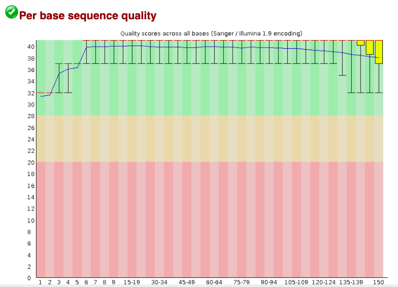
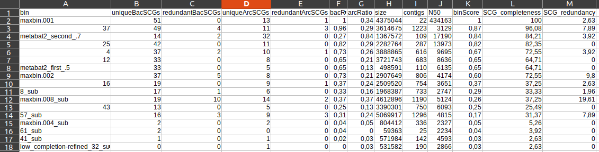
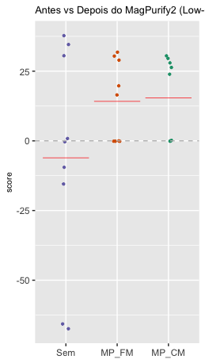

<!-- README.md is generated from README.Rmd. Please edit that file -->
<!-- badges: start -->


<!-- badges: end -->

# Reconstrução de Genomas - Binning! 

**Developer: Victor Borin Centurion - Kelly Hidalgo**

Pipeline para reconstrução de genomas a partir de metagenomas, usando
várias ferramentas de *binning* e *DAS tools* para integrar os
resultados dos algoritmos de binning para calcular um conjunto otimizado
e não redundante de MAGs (*Metagenome Assembled Genomes*) de uma única
montagem.

## Ferramentas bioinformáticas

<font size=2> Para instalação de ferramentas bioinformáticas vai
[aqui]() </font>

### Controle de qualidade

-   [FastQC](https://www.bioinformatics.babraham.ac.uk/projects/fastqc/)

-   [Trimmomatic](http://www.usadellab.org/cms/?page=trimmomatic)

### Assembly

-   [Megahit](https://github.com/voutcn/megahit) (v1.2.4-beta)

### Mapping

-   [Bowtie2](https://github.com/BenLangmead/bowtie2) (v2.3.4.3)

-   [Samtools](https://github.com/samtools/samtools) (v1.9)

### Binning

-   [Metabat2](https://bitbucket.org/berkeleylab/metabat/src/master/)
    (v2.12.1)

-   [Metabat1](https://bitbucket.org/berkeleylab/metabat/src/master/)

-   [CONCOCT](https://github.com/BinPro/CONCOCT) (v1.1.0-0)

-   [MaxBin](https://denbi-metagenomics-workshop.readthedocs.io/en/latest/binning/maxbin.html)
    (v2.2.6)

-   [BinSanity](https://github.com/edgraham/BinSanity) (v0.3.4-0)

-   [Vamb](https://github.com/RasmussenLab/vamb)(v3.0.2)

### Controle de qualidade

-   [Ultrabinner](https://github.com/Huangpq2019/UltraBinner) para
    formatar os Bins como input para DasTools

-   [CheckM](https://github.com/Ecogenomics/CheckM/wiki) (v1.1.2-1)

-   [DasTools](https://github.com/cmks/DAS_Tool) (v1.1.2-0 - efesto)
    (Diamond v0.9.30.131)

### Refinamento

-   [MagPurify2](https://apcamargo.github.io/magpurify2/docs/)(v2.1)

------------------------------------------------------------------------

## Processamento

O *binning* é uma técnica bioinformática para reconstruir genomas a
partir de metagenomas. O processamento inclui as seguintes fases: **1)
Sequenciamento de metagenomas**, do qual vai se obter reads; **2)
Controle de qualidade das reads**, usando ferramentas como *Trimmomatic*
são filtradas as reads de baixa qualidade; **3) Montagem das reads**,
dos quais vão se obter contigs ou scafolds; **4) Mapeamento das reads**,
isto com o objetivo de saber a abundância e o origem de cada read
(informação necessária para a seguinte etapa); **5)** ***Binning***,
usando diferentes ferramentas/algoritmos (i.e. *Metabat2, MaxBin,
CONCOCT, BinSanity*) que clusterizam os contigs/scalfolds baseado em
diferentes características similares tais como: níveis de cobertura de
cada contig/scalfold, genes marcadores de cópia única, perfil de
frequências de tetranucleotídeos, formando os genomas reconstruidos
também conhecidos como *MAGs* ou *Bins*; **6) Controle de qualidade**,
compreende o uso de ferramentas bioinformáticas (i.e. *CheckM, DAStool*)
para á analise da qualidade de cada um dos bins gerados, em ítems como
completude e contaminação; **7) Anotação taxonômica** e **8) Anotação
funcional**

A continuação uma visão geral do processo de **Binning**


<style>
div.blue { background-color:#e6f0ff; border-radius: 5px; padding: 20px;}
</style>

<div class="blue">

> **O que vai encontrar aqui:**
>
> -   Controle de qualidade de sequenciamento shotgun
>
> -   Montagem de metagenomas
>
> -   Mapeamento de reads
>
> -   Reconstrução de genomas
>
> -   Anotação taxonômica e funcional de genomas

</div>

## —

### 1. Sequenciamento massivo de metagenomas

O sequenciamento massivo ou em larga escala de metagenomas, compreende a
extração do DNA total de uma amostra de qualquer ambiente ou tipo de
amostra (i.e. solo, agua, feces, esponjas marinas, tecidos vegetais,
etc) e o sequenciamento por uma técnica chamada *shotgun*. Onde o DNA
total é fragmentado em muitos pedacinhos, os quais são sequenciados
aleatoriamente, obtendo assim as chamadas *reads*, que são sequências
pequenas.


------------------------------------------------------------------------

### 2. Dataset

Primeiro usando comandos básicos de **UNIX** (tutorial [aqui]()), crie
um diretório chamado `binning` desde o qual vão ser rodados todos os
comandos

    mkdir binning 
    cd binning/

Agora dentro de binning crie outro diretório chamado `00.RawData`, onde
vai descarregar o dataset de exemplo para este tutorial

``` bash
mkdir 00.RawData
rm -r 00.RawData
```

Para descarregar o dataset…

    curl -L https://ndownloader.figshare.com/files/12389045 -o dataset.tar.gz
    tar -xzvf dataset.tar.gz
    rm dataset.tar.gz
    cd metagen_tut

Com `ls`você pode ver o conteúdo descarregado. Têm três pastas `data`,
`results` e `working`. Elimine as duas últimas pastas e o conteúdo da
pasta `data` coloque na pasta `00.RawData`.

``` zsh
rm -r metagen_tut/results metagen_tut/working
mv metagen_tut/data/* 00.RawData/
rm -r metagen_tut
ls 00.RawData
```

Por último “listou” (`ls`) o conteúdo da pasta `00.RawData`, vai
observar que têm 4 amostras paired-end (R1 e R2)
`Sample_A_1.fastq.gz    Sample_A_2.fastq.gz   Sample_B_1.fastq.gz   Sample_B_2.fastq.gz   Sample_C_1.fastq.gz   Sample_C_2.fastq.gz   Sample_D_1.fastq.gz Sample_D_2.fastq.gz`

------------------------------------------------------------------------

### 3. Controle de qualidade

**Checagem da qualidade**

Estando no diretório `binning`, crie um diretório chamado
`01.FastqcReports`

    mkdir 01.FastqcReports

A qualidade das reads deve ser checada com a ferramenta *FASTQC*. Se a
ferramenta foi instalada pelo conda, lembre de ativar previamente o
ambiente onde foi instalada

    fastqc -t 10 00.RawData/* -o 01.FastqcReports/

Dentro da pasta `01.fastqcReports/` foram gerados uma série de arquivos
`.html`que correspondem aos reportes de qualidade das sequências de cada
amostra.

Dê uma olhada em cada um deles e avalia a qualidade de suas sequências.
O ideal é que o *Phred Score* seja maior de 30, como minimo 20. Se
necessário trimar as sequências com qualidade baixa.

Veja um exemplo 👇 de uma amostra paired-end

<div class="figure" style="text-align: center">


<p class="caption">
Amostra 1 FORWARD
</p>

</div>

<div class="figure" style="text-align: center">


<p class="caption">
Amostra 1 REVERSE
</p>

</div>

È comum que as sequências reverse tenham uma qualidade inferior às
forward. Mas em termos gerais a amostra do exemplo tem uma qualidade
aceitável.

Veja um exemplo de uma amostra com qualidade baixa 👇

<div class="figure" style="text-align: center">


<p class="caption">
Amostra 2 FORWARD
</p>

</div>

<div class="figure" style="text-align: center">


<p class="caption">
Amostra 2 REVERSE
</p>

</div>

A qualidade da amostra 2 não é toleravel para as análises seguintes.
Mesmo que a amostra 1 tenha uma qualidade aceitável, pode ser melhorada
com a trimagem.

**Trimagem**

Estando na pasta `binning` crie uma nova chamada `02.CleanData` para
armazenar as sequências “limpas” e outra chamada `unpaired` para guardar
as sequências não pareadas de cada amostra.

    mkdir 02.CleanData
    mkdir unpaired

A ferramenta a usar para a trimagem das sequencias é **Trimmomatic**.
Depois de revisar os reportes de qualidade e observar que todas as
amostras podem ser processadas com os mesmos paramêtros de corte, pode
ser usado um loop para facilitar o processo e um comando só processar
todas as amostras.

    for i in 00.RawData/*1.fq.gz 
    do
    BASE=$(basename $i 1.fq.gz)
    trimmomatic PE -threads 20 $i  00.RawData/${BASE}2.fq.gz 02.CleanData/${BASE}1_paired.fq.gz unpaired/${BASE}1_unpaired.fq.gz 02.CleanData/${BASE}2_paired.fq.gz unpaired/${BASE}2_unpaired.fq.gz LEADING:3 TRAILING:3 SLIDINGWINDOW:4:15 MINLEN:150
    done

**Revisar a qualidade de novo**

    fastqc -t 20 02.CleanData/* -o 01.FastqcReports/

Amostra depois da trimagem 👇

<div class="figure" style="text-align: center">


<p class="caption">
Amostra 1 FORWARD
</p>

</div>

<div class="figure" style="text-align: center">


<p class="caption">
Amostra 1 REVERSE
</p>

</div>

<div class="figure" style="text-align: center">


<p class="caption">
Amostra 2 FORWARD
</p>

</div>

<div class="figure" style="text-align: center">


<p class="caption">
Amostra 2 REVERSE
</p>

</div>

Veja a diferença da qualidade depois da trimagem, melhorou muito né? 😀
No entanto tem que ser avaliado com cuidado o número de reads perdidas.
Para estes exemplo teve uma perda de 20% e 28% respeitivamente. As
porcentagens são boas para avaliar, no entanto se o número de sequências
de entrada for muito baixo, tem que balancear entre poucas reads com
alta qualidade, ou mais reads com uma qualidade apenas aceitável.

------------------------------------------------------------------------

### 4. Montagem

Para montar as reads vai ser usado Megahit. Este programa vai usar
algoritmos para construir *contigs* apartir das sequências de todas as
amostras. *Contigs* então, são sequencias mais longas, ou conjunto de
reads.

O modo a usar é de co-assembly, que significa que vai ser feito uma
montagem só com todas as amostras. Para isto primeiramente devem ser
unidos as sequências F ou 1 de todas amostras em um arquivo só, e o
mesmo dever ser feito para as sequências 2 ou R.

**Concatenar as sequências das amostras**

Crie uma pasta para armazenar as sequencias concatenadas.

    mkdir 03.MergeData

Usando o comando `cat`, concatene as sequências forward de todas as
amostras.

    cat 02.CleanData/*_1_* > 03.MergeData/samples_1.fq.gz

Lembre que o \*\*"\*“\*\* significa que é tudo. Ou seja no caso acima,
concatene as amostras que estão dentro da pasta `02.CleanData/`,
qualquer que seja o começo do nome, mas que depois leve um”*1*"
(sequências 1 ou Forward) e depois qualquer que seja o fim do nome, e
crie um arquivo chamado “samples\_1.fq.gz” dentro da pasta
`03.MergeData/`.

Agora faça o mesmo procedimento para as sequências 2 ou reverse.

    cat 02.CleanData/*_2_* > 03.MergeData/samples_2.fq.gz

**Montagem**

Crie uma pasta para armazenar a saída da montagem.

    mkdir 04.Assembly

Se o Megahit estiver instalado pelo Conda, tem que ser ativado o
ambiente onde está instalada a ferramenta.

O tamanho mínimo de contig a usar será de 500.

Com o intuito de melhorar a montagem, as reads unpaired (reads que não
foram pareadas quando foi feita a trimagem que se encontram na pasta
`unpaired/`) podem ser usadas. Para isto o procedimento de concatenar os
arquivos deve ser feito, com a diferença que desta vez vai ser criado um
arquivo só com **TODAS** as sequências.

    cat unpaired/* > 03.MergeData/unpaired.fq.gz

Para a montagem propiamente dita, o comando se encontra abaixo 👇🏿

    nohup megahit -1 03.MergeData/samples_1.fq.gz -2 03.MergeData/samples_2.fq.gz -r 03.MergeData/unpaired.fq.gz --presets meta-large --memory 0.95 --num-cpu-threads 20 -o 04.Assembly1/ --min-contig-len 500 -t 20

Se você quiser explorar as opções do programa, consulte o manual ou
digite o comando `megahit --help`.

O `nohup` no inicio do comando é um programinha que vai guardando em um
arquivo de texto todo o processo do comando. Depois você pode aceder a
ele com o comando `nano nohup.out`.

**Qualidade da montagem**

A qualidade da montagem é avaliada por um programa chamado *MetaQuast*.
Ele gera um reporte completo com todos os dados da montagem. É muito
útil quando você quer comparar varias montagens com diferentes
parâmetros, das mesmas amostras, para assim escolher o melhor.

Lmebre de ativar o ambiente do Conda onde o *MetaQuast* estiver
instalado

    nohup metaquast.py 04.Assembly/final.contigs.fa -o 05.AssemblyQuality

------------------------------------------------------------------------

### 5. Mapping

Agora é preciso fazer o mapeamento as reads originais dentro do
co-assembly para obter informações de cobertura para cada contig em cada
amostra. O programa para isto se chama *Bowtie2*.

Primeiro crie uma pasta para armazenar a saída do mapeamento

    mkdir 06.Mapping

O primeiro passo do mapeamento é criar um índice de nosso co-assembly

    nohup bowtie2-build 04.Assembly/final.contigs.fa 06.Mapping/final_assembly_DB

Agora vamos a mapear as reads das amostras individuais no co-assemblys.
O processo pode ser feito amostra por amostra, o podemos usar um loop
para fazer todas as amostras ao mesmo tempo. **Cuidado:** Fique atento a
nome de suas amostras, e se for necessário modifique o comando, para que
se ajuste as suas amostras.

    for f in 02.CleanData/*_1.fq.gz; do r=${f%_*}_2.fq.gz; BASE=${f##*/}; SAMPLE=${BASE%_*}; bowtie2 -q -1 $f -2 $r -x 06.Mapping/final_assembly_DB -p 10 -S 06.Mapping/${f%_*}.sam; done

A linha de comando para cada amostra é:

    bowtie2 -q -1 02.CleanData/B52_1.fq.gz -2 02.CleanData/B52_2.fq.gz -x 06.Mapping/final_assembly_DB -p 10 -S 06.Mapping/B52.sam

Agora é necessário converter os arquivos `.sam` para `.bam`. Também será
feito o comando usando um loop

    cd 06.Mapping/
    for f in *.sam; do filename="${f%%.*}"; samtools view -@ 10 $f -b > ${filename}.bam; done

O comando individual é:

    samtools view -b -o 06.Mapping/B52.bam 06.Mapping/B52.sam

Após transformar em arquivo `.bam`, devem ser ordenados.

    for f in *.bam; do filename="${f%%.*}"; samtools sort -@ 10 $f > ${filename}.sorted.bam; done

    ls ## conferir que estejam os arquivos

E por úlitmo os arquivos vão ser indexados

    for f in *.sorted.bam; do filename="${f%%.*}"; samtools index -@ 10 $f > ${filename}.index.bam; done

    samtools index -@ 10 B52.sorted.bam B52.index.bam

    ## para voltar na pasta raiz 02.Binning/
    cd ..

------------------------------------------------------------------------

### 6. Binning

Para a reconstrução dos genomas, serão usadas várias ferramentas para
ter um número maior de MAGs recuperados.

#### 6.1. MetaBat2

Crie uma pasta para armazenar a saída do processamento em *MetaBat2*

    mkdir 07.MetaBat2

Usando os arquivos ordenados `.sorted..bam` vai gerar um arquivo `.txt`
com a informação da cobertura, necessária para a recuperação dos
genomas. Como sempre lembrando que precisa ativar o ambiente onde se
encontra instalado o *MetaBat2*

    jgi_summarize_bam_contig_depths --outputDepth 07.MetaBat2/Depth.txt 06.Mapping/*sorted.bam

O *MetaBat2* tem vários parâmetros para customizar, o tamanho minimo de
contig é o mais comum de ser modificado. Neste pipeline você vai
encontrar três rodadas com *MetaBat2* com diferentes tamanhos minimos de
contigs.

**First Trial**

Crie um diretório dentro da pasta `07.MetaBat2` chamado `01.FirstTrial`

    mkdir 07.MetaBat2/01.FirstTrial

Para este primeiro trial o tamanho minimo de contig será de 1500

    nohup metabat2 -i 04.Assembly/final.contigs.fa -a 07.MetaBat2/Depth.txt -m 1500 -t 10 -o 07.MetaBat2/01.FirstTrial/Metabat2_firsttrial_

Para o segundo trial o tamanho minimo de contig será de 2500, que é o
default da ferramenta, por isso não precisa colocar o flag `-m`.

    mkdir 07.MetaBat2/02.SecondTrial

    nohup metabat2 -i 04.Assembly/final.contigs.fa -a 07.MetaBat2/Depth.txt -t 10 -o 07.MetaBat2/02.SecondTrial/Metabat2_secondtrial_

Por último, para terceira rodada, serão modificados mais parâmetros.
Para conhecer todos os paråmetros que podem ser customizados, digite o
comando `metabt2 --help`. Com o flag `-m` ou `--minContig`, como já foi
usado nas rodadas anteriores é possível modificar o tamanho mínimo dos
contigs, para este caso será usado 3000. Com o flag `--maxEdges`,
pode-se modificar o máximo número de *edges* (arestas) por nó. Entre
maior seja o número, o algoritmo é mais sensitivo. O default é 200, vai
ser usado 500. O flag `--minS` modifica o socre mínimo de cada *edge*,
entre maior seja é mais específico. O default é 60, vai ser usado 80.
Então o comando é o seguinte:

    mkdir 07.MetaBat2/03.ThirdTrial

    nohup metabat2 -i 04.Assembly/final.contigs.fa -a 07.MetaBat2/Depth.txt -t 10 --minContig 3000 --minCV 1.0 --minCVSum 1.0 --minS 80 --maxEdges 500 -o 07.MetaBat2/03.ThirdTrial/Metabat2_thirdtrial_

#### 6.2. CONCOCT

A seguinte ferramenta de reconstrução de genomas é *CONCOCT*. Ative o
ambiente do Conda onde está instalada a ferramenta.

Crie uma pasta para armazenar os arquivos de saída do *CONCOCT*

    mkdir 08.CONCOCT

Primeiramente vão ser cortados os contigs em partes menores

    cut_up_fasta.py 04.Assembly/final.contigs.fa -c 10000 -o 0 --merge_last -b 08.CONCOCT/contigs_10K.bed > 08.CONCOCT/contigs_10K.fa

Agora será gerada uma tabela com a informação da cobertura por amostra e
subcontig, usando os arquivos `.sorted.bam`.

    concoct_coverage_table.py 08.CONCOCT/contigs_10K.bed 06.Mapping/*.sorted.bam > 08.CONCOCT/coverage_table.tsv

Rode o CONCOCT

    concoct --composition_file 08.CONCOCT/contigs_10K.fa --coverage_file 08.CONCOCT/coverage_table.tsv --length_threshold 1500 --threads 30 -b 08.CONCOCT/

Agora mesclar o agrupamento contig no agrupamento dos contigs originais

    merge_cutup_clustering.py 08.CONCOCT/clustering_gt1500.csv > 08.CONCOCT/clustering_merged.csv

Extrair os bins como arquivos individuais FASTA

    mkdir 08.CONCOCT/bins

    extract_fasta_bins.py 04.Assembly/final.contigs.fa 08.CONCOCT/clustering_merged.csv --output_path 08.CONCOCT/bins

#### 6.3. MaxBin

A terceira ferramenta é chamada *MaxBin*.

Primeiro crie a pasta para saída do *MaxBin*

    mkdir 09.MaxBin

Para obter a informação da cobertura são usados os arquivos `.sam`. Para
facilitar primeiro entre na pasta anteriormente criada

    cd 09.MaxBin/

Copie os arquivos gerados no mapeamento (`.sam`) que se encontram na
pasta `06.Mapping/` para a pasta atual (`09.MaxBin/`)

    cp ../06.Mapping/*.sam ./

Gere os arquivos de cobertura

    for f in *.sam; do pileup.sh in=$f out=${f%}.txt; done

    cd .. ## sair da pasta para ficar na pasta base 09.MaxBin/

Depois gere um arquivo com os nomes e caminhos dos arquivos de cobertura
gerados acima

    ls 09.MaxBin/*sam.txt > 09.MaxBin/abundance.list

A continuação o comando para gerar os bins com *MaxBin*

    run_MaxBin.pl -contig 04.Assembly/final.contigs.fa -abund_list 09.MaxBin/abundance.list -max_iteration 20 -min_contig_length 1500 -thread 10 -out 09.MaxBin/bins/maxbin

*MaxBin* gera os MAGs com extensão `.fasta`, mas para facilitar as
análises downstream e padronizar a mesma extensão dos bins gerados por
todas as ferramentas, é melhor converter eles para `.fa`.

Para isto vamos a usar um loop for, para realizar o procedimento com
todos bins de uma vez só.

    cd 09.MaxBin/

    for file in *.fasta
    do mv "$file" "$(basename "$file" .fasta).fa"
    done

    ls ## para conferir que agora todos os bins terminam em .fa

    cd ../ # para voltar à pasta base

#### 6.4. BinSanity

A quarta e última ferramenta se chama *BinSanity*. Como sempre crie uma
pasta para a saída do processamento nesta ferramenta.

    mkdir 10.BinSanity

Gere a informação da cobertura das amostras

    Binsanity-profile -i 04.Assembly/final.contigs.fa -s 06.Mapping/ -T 10 -c 10.BinSanity/coverage_profile.txt -o 10.BinSanity/

No seguinte comando serão gerados os bins

    Binsanity-lc -f . -l 04.Assembly/final.contigs.fa --kmean_threads 10 -x 1500 --checkm_threads 10 --Prefix binsanity_ -c 10.BinSanity/coverage_profile.txt.cov.x100.lognorm

*BinSanity* criou uma pasta com onde estão todos os resultados da
corrida `BINSANITY-RESULTS/` e os bins se encontram em
`BINSANITY-RESULTS/binsanity_-KMEAN-BINS/`

Ao igual que com *MaxBin* tem que converter os bins para `.fa`, com a
diferença que o *BinSanity* gera os MAGs com extensão `.fna`.

    cd BINSANITY-RESULTS/binsanity_-KMEAN-BINS/

    for file in *.fna
    do mv "$file" "$(basename "$file" .fna).fa"
    done

    ls ## para conferir que agora todos os bins terminam em .fa

    cd ../../ # Para voltar à pasta base

#### 6.5. Vamb

A quinta ferramenta de binning que vai ser usada é chamada *Vamb*
(*Variational autoencoder for metagenomic binning*). Esta ferramenta usa
a informação da composição das sequencias dos contigs e a informação de
co-abundância dos arquivos `.bam` para clusterizar em bins.

Para facilitar o processo, pode ser usado o arquivo
`07.Metabat2/Depth.txt` gerado para rodar o *Metabat2* com o comando
`--jgi_summarize_bam_contigs_depths`.

    vamb --outdir 11.Vamb --fasta 04.Assembly/final.contigs.fa --jgi 07.MetaBat2/Depth.txt --minfasta 200000 -m 500

Ao igual que o *BinSanity*, o *Vamb* gera os bins com extensão `.fna`,
por tanto é necessário converter eles para `.fa`.

    cd 11.Vamb/bins/

    for file in *.fna
    do mv "$file" "$(basename "$file" .fna).fa"
    done

    ls ## para conferir que agora todos os bins terminam em .fa

    cd ../../ # Para voltar à pasta base

------------------------------------------------------------------------

### 7. Desreplicação com DAS TOOL

o *DAS Tool* é uma ferramenta que integra os resultados de diferentes
ferramentas de reconstrução de genomas (Binning) para determinar o
conjunto otimizado de MAGs, não redundantes de uma única montagem.

    mkdir 12.DasTool

Nem todas as ferramentas de binning fornecem resultados em formato de
tabela `.tsv`, com o contigs IDs e os bin IDs. Para formatar isto o *DAS
Tool* tem um script adicional `scaffolds2bin` que converte um conjunto
de bins no formato `.fasta`em um arquivo tabular para ser usado como
input do *DAS Tool*. Salve as tabelas na pasta criada para *DAS Tool*.

    cd 07.MetaBat2/01.FirstTrial/ #entrar na pasta da primeira rodada com o MetaBat2

    Fasta_to_Scaffolds2Bin.sh -e fa > ../../12.DasTool/metabat2_firsttrial.tsv #Script pra criar a tabela

    cd ../02.SecondTrial/ 

    Fasta_to_Scaffolds2Bin.sh -e fa > ../../12.DasTool/metabat2_secondtrial.tsv

    cd ../03.ThirdTrial/

    Fasta_to_Scaffolds2Bin.sh -e fa > ../../12.DasTool/metabat2_thirdtrial.tsv

    cd ../../08.CONCOCT/bins/

    Fasta_to_Scaffolds2Bin.sh -e fa > ../../12.DasTool/concoct.tsv

    cd ../../09.MaxBin/

    Fasta_to_Scaffolds2Bin.sh -e fa > ../12.DasTool/maxbin.tsv

    cd ../BINSANITY-RESULTS/binsanity_-KMEAN-BINS/

    Fasta_to_Scaffolds2Bin.sh -e fa > ../../12.DasTool/binsanity.tsv

    cd ../../11.Vamb/bins/

    Fasta_to_Scaffolds2Bin.sh -e fa > ../../12.DasTool/vamb.tsv

Após criadas as tabelas dos bins de cada ferramenta usada, é rodado o
*DAS Tool*

    cd ../../12.DasTool/

    DAS_Tool -i vamb.tsv,binsanity.tsv,concoct.tsv,maxbin.tsv,metabat2_firsttrial.tsv,metabat2_secondtrial.tsv,metabat2_thirdtrial.tsv -l vamb,binsanity,concoct,maxbin,metabat2ft,metabat2st,metabat3tt -c ../04.Assembly/final.contigs.fa -t 10 -o ./ --score_threshold 0.5 --write_bins 1 --search_engine diamond

Após terminar a corrida do *DAS Tool*, descarregue os arquivos: \*
`_DASTool_hqBins.pdf` \* `_DASTool_summary.txt` \* `_DASTool_scores.pdf`

Para descarregar arquivos desde o servidor para seu computador o comando
usado é `scp`. Aqui um exemplo:

    scp usuario@ip.do.seu.servidor:/caminho/do/arquivo caminho/no/seu/computador/

Esse comando deve ser rodado no terminal do **seu computador**.

Explore os arquivos descarregados. O `_DASTool_hqBins.pdf` é um gráfico
de barras que mostra o número de bins gerados por cada ferramenta e os
bins que passaram o filtro definido no *DAS Tool*, para nosso caso score
&gt; 0.5, diferenciando por tons de azul o número de bins de completude
&gt;90%, &gt;80%, &gt;70%, &gt;%60.

<div class="figure" style="text-align: center">


<p class="caption">
Gráfico qualidade dos bins - DASTools
</p>

</div>

O `_DASTool_scores.pdf`, é um gráfico de distribuição dos bins de cada
ferramenta pelo score. Entre maior seja a área de distribuição para cima
é melhor, porque significa que maior quantidade de MAGs com score
próximo de 1 foram gerados.

<div class="figure" style="text-align: center">


<p class="caption">
Gráfico de score dos bins - DASTools
</p>

</div>

Por último `_DASTool_summary.txt`, é uma tabela com muitas informações
dos bins que passaram o filtro do *DAS Tool* (p.e. “size”, “contigs”,
“N50”, “binScore”, “SCG\_completeness”, “SCG\_redundancy”)

<div class="figure" style="text-align: center">


<p class="caption">
Tabela DASTools
</p>

</div>

## Adicionalmente, o **DAS Tool** separa os bins que passaram o *threshold* na pasta `12.DasTool/_DASTool_bins/`.

### 8. Qualidade dos MAGs

A qualidade dos MAGs é avaliada usando uma ferramenta chamada *CheckM*.
Basicamente a avaliação consiste em comparar os MAGs com uma base de
dados de genes de cópia única para assim saber que tão completo e
contaminado está cada um dos genomas recuperados.

Serão analisados os genomas desreplicados da saída do **DAS Tool**
(`12.DasTool/_DASTool_bins/`)

Agora crie uma pasta para armazenar a saída do *CheckM*:

    mkdir 13.CheckM

Para rodar o *CheckM* é preciso criar um diretório para os arquivos
temporais que serão criados enquanto a corrida.

    mkdir tmp

Lembre **SEMPRE** que **TODA** ferramenta tem um menú de ajuda (`-h` ou
`--help`).

Para rodar a análise de qualidade pelo *CheckM* use o seguinte comando:

    checkm lineage_wf 12.DasTool/_DASTool_bins/ 13.CheckM/ -t 10 -x fa --tmpdir tmp --tab > 13.CheckM/output.txt

------------------------------------------------------------------------

### 9. Refinamento com MagPurify2

**MagPurify2** é uma ferramenta que auxilia no refinamento dos MAGs,
eliminando contaminação, baseado nas caracteristicas genômicas dos
contigs, usados para a clusterização. Essas características são: **(1)**
frequências de tetranucleotideos, **(2)** conteúdo de GC, **(3)**
coverage e **(4)** genome codon usage.

Basicamente o programa analisa todos os MAGs, procurando divergencias
entre os contigs de cada um repeito às caracteristicas genômicas, para
assim detectar contigs contaminantes, os quais na última etapa serão
eliminados dos bins, purificando os genomas.

Esta ferramenta tem um recurso muito interessante, que consiste em usar
a tabela de saída do **CheckM**, com a qual ela vai ajustar os
**cut-off** dependendo da qualidade medida pelo \*CheckM\*\*.

Para gerar essa tabela, é necessário rodar um comando do **CheckM**.

    checkm qa --threads 10 --tab_table --file 13.CheckM/checkm_output.tsv 13.CheckM/lineage.ms 13.CheckM/

Após obtida a tabela, pode ser rodado o **MagPurify2**. Você pode rodar
cada módulo por separado um atrás do outro, com uma linha de comando
para cada um. (consulte `magpurify --help`)

> **Módulos** - composition Identify putative contaminants using
> tetranucleotide frequencies and GC content. - coverage Identify
> putative contaminants using coverage profiles. - codon\_usage Identify
> putative contaminants using gene codon usage profiles. - taxonomy
> Identify putative contaminants through taxonomy assignment. - filter
> Remove identified contaminants from input MAGs)

Ou usar o modo end\_to\_end, que vai rodar todos os módulos, também um
trás do outro, mas de maneira automática, com uma linha de comando só,
que se encontra a continuação:

    magpurify2 end_to_end 12.DasTool/_DASTool_bins/* 14.MagPurify2 15.MagPurify_filtered_bins --bam_files 06.Mapping/B52.sorted.bam 06.Mapping/B63.sorted.bam 06.Mapping/B65.sorted.bam 06.Mapping/PM62.sorted.bam 06.Mapping/PM63.sorted.bam 06.Mapping/PM65.sorted.bam --fast_mode -t 10 --checkm_file 13.CheckM/checkm_output.tsv

Na linha de comando anterior foi usado o modo rápido (`--fast_mode`), no
qual não é feita a predição de genes nem a clasificação taxonômica. Para
rodar o modo completo o comando é o seguinte:

    magpurify2 end_to_end 12.DasTool/_DASTool_bins/* 16.MagPurify2_complete 17.MagPurify_filtered_bins_completed --bam_files 06.Mapping/B52.sorted.bam 06.Mapping/B63.sorted.bam 06.Mapping/B65.sorted.bam 06.Mapping/PM62.sorted.bam 06.Mapping/PM63.sorted.bam 06.Mapping/PM65.sorted.bam --taxonomy_database /home/bioinfo/Documentos/Databases/MagPurify/magpurify2DB -t 10 --checkm_file 13.CheckM/checkm_output.tsv

Após o refinamento é necessário rodar novamente o *CheckM*, para
conferir as melhoras na contaminação dos MAGs.

**Magpurify2** `--fastmode`

    mkdir 18.CheckMFiltered

    checkm lineage_wf 15.MagPurify_filtered_bins/ 18.CheckMFiltered/ -t 10 -x fna --tmpdir tmp --tab > 18.CheckMFiltered/output_filtered.txt

    checkm qa --threads 10 --tab_table --file 18.CheckMFiltered/checkm_filtered_output.tsv 18.CheckMFiltered/lineage.ms 18.CheckMFiltered/

**Magpurify2** `complete mode`

    mkdir 19.CheckMFiltered_complete

    checkm lineage_wf 17.MagPurify_filtered_bins_completed/ 19.CheckMFiltered_complete -t 10 -x fna --tmpdir tmp --tab > 19.CheckMFiltered_complete/output_filtered.txt

    checkm qa --threads 10 --tab_table --file 19.CheckMFiltered_complete/checkm_filtered_complete_output.tsv 19.CheckMFiltered_complete/lineage.ms 19.CheckMFiltered_complete/

Descarregue as tabelas do *CheckM* de antes e depois do refinamento com
*MagPurify2* e compare os resultados.

Para comparar os resultados dos **score** dos bins, de antes vs depois
do refinamento foram construídos *scriptcharts* com o pacote **ggplot2**
de R. Script
[aqui](https://github.com/khidalgo85/Binning/blob/master/binning.R)

**Score**




### 10. Anotação Taxonômica

Existem diversas ferramentas para anotação taxonômica, no entanto a mais
utilizada em estudos com MAGs é **GTDB-Tk**. O qual é um software criado
para asignação taxonômica de genomas de bactérias e arqueias baseado no
**Genome Database Taxonomy - GTDB**. Dentro desta base de dados existe
uma grande quantidade de MAGs obtidos de amostras ambientais.

A anotação taxonômica com **GTDB-Tk** precisa de \~152 gb de memória
RAM, o qual é um gasto computacional muito alto. No entanto, esta
ferramenta se encontra na plataforma [KBase](https://www.kbase.us/), na
qual é rodado em um servidor público, sem ter que se preocupar pelas
especificações de sua maquina.

O primeiro passo é criar uma conta
[aqui](https://narrative.kbase.us/#signup). Depois explore as
funcionalidades da plataforma e aprenda a usá-la, aqui.

Enquanto isso, desde o servidor descarregue seus bins
(`12.DasTool/_DASTool_bins/`). No **KBase**, crie uma nova *narrativa*.
Depois suba seus bins, e importe eles. Para importa todo o set de bins
mais facilmente, procure nas apps *Batch Import Assembly from Staging
Area*. Desse jeito todos seus genomas serão subidos na narrativa criada
e estarão disponíveis para as análises seguintes. É importante que na
descrição do tipo de arquivo que está subindo, coloque que se trata de
MAGs.

Após carregados todos os genomas na plataforma, procure no menú de apps
*GTDB-Tk classify*, selecione o set de bins carregados e dê click em
Run, aguarde até o resultado estiver pronto e descarregue a tabela
`.csv` do reporte. A tabela é um pouco bagunçada, mas use o Excel para
ajeitar, de maneira que fique só as colunas mais importantes, tais como
*Genoma, Clasificação taxonômica* (aqui é bom separar em colunas, por
cada nível taxonômico). Use este
[script](https://github.com/khidalgo85/Binning/blob/master/taxonomy.R)
para juntar esta tabela, com a criada no [script da saída do
Magpurify](https://github.com/khidalgo85/Binning/blob/master/binning.R)
usado para comparação do antes e depois de usá-lo, e gerar uma grande
tabela com as informações mais relavantes do processo de binning.

<table class="table table table" style="margin-left: auto; margin-right: auto; margin-left: auto; margin-right: auto; margin-left: auto; margin-right: auto;">
<thead>
<tr>
<th style="text-align:left;">
Genome
</th>
<th style="text-align:left;">
Domain
</th>
<th style="text-align:left;">
Phylum
</th>
<th style="text-align:left;">
Class
</th>
<th style="text-align:left;">
Order
</th>
<th style="text-align:left;">
Family
</th>
<th style="text-align:left;">
Genera
</th>
<th style="text-align:left;">
Species
</th>
<th style="text-align:left;">
Completeness\_before
</th>
<th style="text-align:left;">
Completeness\_after
</th>
<th style="text-align:left;">
Contamination.before
</th>
<th style="text-align:left;">
Contamination\_after
</th>
<th style="text-align:left;">
score.before
</th>
<th style="text-align:left;">
score.after
</th>
<th style="text-align:left;">
Bin.Tool
</th>
<th style="text-align:left;">
Inicial.MiMAG.Quality
</th>
<th style="text-align:left;">
Final.MiMAG.Quality
</th>
</tr>
</thead>
<tbody>
<tr>
<td style="text-align:left;font-weight: bold;color: white !important;background-color: red !important;">
107\_sub
</td>
<td style="text-align:left;font-weight: bold;color: white !important;background-color: red !important;">
Bacteria
</td>
<td style="text-align:left;font-weight: bold;color: white !important;background-color: red !important;">
Dependentiae
</td>
<td style="text-align:left;font-weight: bold;color: white !important;background-color: red !important;">
Babeliae
</td>
<td style="text-align:left;font-weight: bold;color: white !important;background-color: red !important;">
Babeliales
</td>
<td style="text-align:left;font-weight: bold;color: white !important;background-color: red !important;">
Vermiphilaceae
</td>
<td style="text-align:left;font-weight: bold;color: white !important;background-color: red !important;">
</td>
<td style="text-align:left;font-weight: bold;color: white !important;background-color: red !important;">
</td>
<td style="text-align:left;font-weight: bold;color: white !important;background-color: red !important;">
49.18
</td>
<td style="text-align:left;font-weight: bold;color: white !important;background-color: red !important;">
27.88
</td>
<td style="text-align:left;font-weight: bold;color: white !important;background-color: red !important;">
11.71
</td>
<td style="text-align:left;font-weight: bold;color: white !important;background-color: red !important;">
0
</td>
<td style="text-align:left;font-weight: bold;color: white !important;background-color: red !important;">
-9.37
</td>
<td style="text-align:left;font-weight: bold;color: white !important;background-color: red !important;">
27.88
</td>
<td style="text-align:left;font-weight: bold;color: white !important;background-color: red !important;">
CONCOCT
</td>
<td style="text-align:left;font-weight: bold;color: white !important;background-color: red !important;">
Low-Quality
</td>
<td style="text-align:left;font-weight: bold;color: white !important;background-color: red !important;">
Low-Quality
</td>
</tr>
<tr>
<td style="text-align:left;font-weight: bold;color: white !important;background-color: green !important;">
11\_sub
</td>
<td style="text-align:left;font-weight: bold;color: white !important;background-color: green !important;">
Bacteria
</td>
<td style="text-align:left;font-weight: bold;color: white !important;background-color: green !important;">
Bacteroidota
</td>
<td style="text-align:left;font-weight: bold;color: white !important;background-color: green !important;">
Kapabacteria
</td>
<td style="text-align:left;font-weight: bold;color: white !important;background-color: green !important;">
Kapabacteriales
</td>
<td style="text-align:left;font-weight: bold;color: white !important;background-color: green !important;">
XYC2-FULL-35-21
</td>
<td style="text-align:left;font-weight: bold;color: white !important;background-color: green !important;">
</td>
<td style="text-align:left;font-weight: bold;color: white !important;background-color: green !important;">
</td>
<td style="text-align:left;font-weight: bold;color: white !important;background-color: green !important;">
96.89
</td>
<td style="text-align:left;font-weight: bold;color: white !important;background-color: green !important;">
96.34
</td>
<td style="text-align:left;font-weight: bold;color: white !important;background-color: green !important;">
0.55
</td>
<td style="text-align:left;font-weight: bold;color: white !important;background-color: green !important;">
0.55
</td>
<td style="text-align:left;font-weight: bold;color: white !important;background-color: green !important;">
94.14
</td>
<td style="text-align:left;font-weight: bold;color: white !important;background-color: green !important;">
93.59
</td>
<td style="text-align:left;font-weight: bold;color: white !important;background-color: green !important;">
CONCOCT
</td>
<td style="text-align:left;font-weight: bold;color: white !important;background-color: green !important;">
High-Quality
</td>
<td style="text-align:left;font-weight: bold;color: white !important;background-color: green !important;">
High-Quality
</td>
</tr>
<tr>
<td style="text-align:left;font-weight: bold;color: white !important;background-color: orange !important;">
114\_sub
</td>
<td style="text-align:left;font-weight: bold;color: white !important;background-color: orange !important;">
Bacteria
</td>
<td style="text-align:left;font-weight: bold;color: white !important;background-color: orange !important;">
Patescibacteria
</td>
<td style="text-align:left;font-weight: bold;color: white !important;background-color: orange !important;">
Microgenomatia
</td>
<td style="text-align:left;font-weight: bold;color: white !important;background-color: orange !important;">
GWA2-44-7
</td>
<td style="text-align:left;font-weight: bold;color: white !important;background-color: orange !important;">
UBA8517
</td>
<td style="text-align:left;font-weight: bold;color: white !important;background-color: orange !important;">
UBA8517
</td>
<td style="text-align:left;font-weight: bold;color: white !important;background-color: orange !important;">
</td>
<td style="text-align:left;font-weight: bold;color: white !important;background-color: orange !important;">
56.84
</td>
<td style="text-align:left;font-weight: bold;color: white !important;background-color: orange !important;">
38.03
</td>
<td style="text-align:left;font-weight: bold;color: white !important;background-color: orange !important;">
5.45
</td>
<td style="text-align:left;font-weight: bold;color: white !important;background-color: orange !important;">
1.49
</td>
<td style="text-align:left;font-weight: bold;color: white !important;background-color: orange !important;">
29.59
</td>
<td style="text-align:left;font-weight: bold;color: white !important;background-color: orange !important;">
30.58
</td>
<td style="text-align:left;font-weight: bold;color: white !important;background-color: orange !important;">
CONCOCT
</td>
<td style="text-align:left;font-weight: bold;color: white !important;background-color: orange !important;">
Medium-Quality
</td>
<td style="text-align:left;font-weight: bold;color: white !important;background-color: orange !important;">
Low-Quality
</td>
</tr>
<tr>
<td style="text-align:left;font-weight: bold;color: white !important;background-color: orange !important;">
116
</td>
<td style="text-align:left;font-weight: bold;color: white !important;background-color: orange !important;">
Bacteria
</td>
<td style="text-align:left;font-weight: bold;color: white !important;background-color: orange !important;">
Dependentiae
</td>
<td style="text-align:left;font-weight: bold;color: white !important;background-color: orange !important;">
Babeliae
</td>
<td style="text-align:left;font-weight: bold;color: white !important;background-color: orange !important;">
Babeliales
</td>
<td style="text-align:left;font-weight: bold;color: white !important;background-color: orange !important;">
Babeliaceae
</td>
<td style="text-align:left;font-weight: bold;color: white !important;background-color: orange !important;">
</td>
<td style="text-align:left;font-weight: bold;color: white !important;background-color: orange !important;">
</td>
<td style="text-align:left;font-weight: bold;color: white !important;background-color: orange !important;">
80.27
</td>
<td style="text-align:left;font-weight: bold;color: white !important;background-color: orange !important;">
79.21
</td>
<td style="text-align:left;font-weight: bold;color: white !important;background-color: orange !important;">
0
</td>
<td style="text-align:left;font-weight: bold;color: white !important;background-color: orange !important;">
0
</td>
<td style="text-align:left;font-weight: bold;color: white !important;background-color: orange !important;">
80.27
</td>
<td style="text-align:left;font-weight: bold;color: white !important;background-color: orange !important;">
79.21
</td>
<td style="text-align:left;font-weight: bold;color: white !important;background-color: orange !important;">
CONCOCT
</td>
<td style="text-align:left;font-weight: bold;color: white !important;background-color: orange !important;">
Medium-Quality
</td>
<td style="text-align:left;font-weight: bold;color: white !important;background-color: orange !important;">
Medium-Quality
</td>
</tr>
<tr>
<td style="text-align:left;font-weight: bold;color: white !important;background-color: green !important;">
124
</td>
<td style="text-align:left;font-weight: bold;color: white !important;background-color: green !important;">
Bacteria
</td>
<td style="text-align:left;font-weight: bold;color: white !important;background-color: green !important;">
Desulfuromonadota
</td>
<td style="text-align:left;font-weight: bold;color: white !important;background-color: green !important;">
Desulfuromonadia
</td>
<td style="text-align:left;font-weight: bold;color: white !important;background-color: green !important;">
Geobacterales
</td>
<td style="text-align:left;font-weight: bold;color: white !important;background-color: green !important;">
Geobacteraceae
</td>
<td style="text-align:left;font-weight: bold;color: white !important;background-color: green !important;">
</td>
<td style="text-align:left;font-weight: bold;color: white !important;background-color: green !important;">
</td>
<td style="text-align:left;font-weight: bold;color: white !important;background-color: green !important;">
100
</td>
<td style="text-align:left;font-weight: bold;color: white !important;background-color: green !important;">
79.48
</td>
<td style="text-align:left;font-weight: bold;color: white !important;background-color: green !important;">
2.26
</td>
<td style="text-align:left;font-weight: bold;color: white !important;background-color: green !important;">
0
</td>
<td style="text-align:left;font-weight: bold;color: white !important;background-color: green !important;">
88.7
</td>
<td style="text-align:left;font-weight: bold;color: white !important;background-color: green !important;">
79.48
</td>
<td style="text-align:left;font-weight: bold;color: white !important;background-color: green !important;">
CONCOCT
</td>
<td style="text-align:left;font-weight: bold;color: white !important;background-color: green !important;">
High-Quality
</td>
<td style="text-align:left;font-weight: bold;color: white !important;background-color: green !important;">
Medium-Quality
</td>
</tr>
<tr>
<td style="text-align:left;font-weight: bold;color: white !important;background-color: orange !important;">
135
</td>
<td style="text-align:left;font-weight: bold;color: white !important;background-color: orange !important;">
Bacteria
</td>
<td style="text-align:left;font-weight: bold;color: white !important;background-color: orange !important;">
Patescibacteria
</td>
<td style="text-align:left;font-weight: bold;color: white !important;background-color: orange !important;">
Paceibacteria
</td>
<td style="text-align:left;font-weight: bold;color: white !important;background-color: orange !important;">
UBA9983\_A
</td>
<td style="text-align:left;font-weight: bold;color: white !important;background-color: orange !important;">
UBA5272
</td>
<td style="text-align:left;font-weight: bold;color: white !important;background-color: orange !important;">
UBA11704
</td>
<td style="text-align:left;font-weight: bold;color: white !important;background-color: orange !important;">
</td>
<td style="text-align:left;font-weight: bold;color: white !important;background-color: orange !important;">
56.87
</td>
<td style="text-align:left;font-weight: bold;color: white !important;background-color: orange !important;">
51.78
</td>
<td style="text-align:left;font-weight: bold;color: white !important;background-color: orange !important;">
6.37
</td>
<td style="text-align:left;font-weight: bold;color: white !important;background-color: orange !important;">
1.12
</td>
<td style="text-align:left;font-weight: bold;color: white !important;background-color: orange !important;">
25.02
</td>
<td style="text-align:left;font-weight: bold;color: white !important;background-color: orange !important;">
46.18
</td>
<td style="text-align:left;font-weight: bold;color: white !important;background-color: orange !important;">
CONCOCT
</td>
<td style="text-align:left;font-weight: bold;color: white !important;background-color: orange !important;">
Medium-Quality
</td>
<td style="text-align:left;font-weight: bold;color: white !important;background-color: orange !important;">
Medium-Quality
</td>
</tr>
<tr>
<td style="text-align:left;font-weight: bold;color: white !important;background-color: green !important;">
136
</td>
<td style="text-align:left;font-weight: bold;color: white !important;background-color: green !important;">
Bacteria
</td>
<td style="text-align:left;font-weight: bold;color: white !important;background-color: green !important;">
Proteobacteria
</td>
<td style="text-align:left;font-weight: bold;color: white !important;background-color: green !important;">
Gammaproteobacteria
</td>
<td style="text-align:left;font-weight: bold;color: white !important;background-color: green !important;">
Pseudomonadales
</td>
<td style="text-align:left;font-weight: bold;color: white !important;background-color: green !important;">
Moraxellaceae
</td>
<td style="text-align:left;font-weight: bold;color: white !important;background-color: green !important;">
Moraxella\_A
</td>
<td style="text-align:left;font-weight: bold;color: white !important;background-color: green !important;">
Moraxella\_A aerosaccus
</td>
<td style="text-align:left;font-weight: bold;color: white !important;background-color: green !important;">
99.14
</td>
<td style="text-align:left;font-weight: bold;color: white !important;background-color: green !important;">
97.41
</td>
<td style="text-align:left;font-weight: bold;color: white !important;background-color: green !important;">
0.38
</td>
<td style="text-align:left;font-weight: bold;color: white !important;background-color: green !important;">
0.38
</td>
<td style="text-align:left;font-weight: bold;color: white !important;background-color: green !important;">
97.24
</td>
<td style="text-align:left;font-weight: bold;color: white !important;background-color: green !important;">
95.51
</td>
<td style="text-align:left;font-weight: bold;color: white !important;background-color: green !important;">
CONCOCT
</td>
<td style="text-align:left;font-weight: bold;color: white !important;background-color: green !important;">
High-Quality
</td>
<td style="text-align:left;font-weight: bold;color: white !important;background-color: green !important;">
High-Quality
</td>
</tr>
<tr>
<td style="text-align:left;font-weight: bold;color: white !important;background-color: green !important;">
14
</td>
<td style="text-align:left;font-weight: bold;color: white !important;background-color: green !important;">
Bacteria
</td>
<td style="text-align:left;font-weight: bold;color: white !important;background-color: green !important;">
Bacteroidota
</td>
<td style="text-align:left;font-weight: bold;color: white !important;background-color: green !important;">
Bacteroidia
</td>
<td style="text-align:left;font-weight: bold;color: white !important;background-color: green !important;">
Flavobacteriales
</td>
<td style="text-align:left;font-weight: bold;color: white !important;background-color: green !important;">
Flavobacteriaceae
</td>
<td style="text-align:left;font-weight: bold;color: white !important;background-color: green !important;">
Flavobacterium
</td>
<td style="text-align:left;font-weight: bold;color: white !important;background-color: green !important;">
</td>
<td style="text-align:left;font-weight: bold;color: white !important;background-color: green !important;">
98.37
</td>
<td style="text-align:left;font-weight: bold;color: white !important;background-color: green !important;">
94.54
</td>
<td style="text-align:left;font-weight: bold;color: white !important;background-color: green !important;">
3.69
</td>
<td style="text-align:left;font-weight: bold;color: white !important;background-color: green !important;">
2.69
</td>
<td style="text-align:left;font-weight: bold;color: white !important;background-color: green !important;">
79.92
</td>
<td style="text-align:left;font-weight: bold;color: white !important;background-color: green !important;">
81.09
</td>
<td style="text-align:left;font-weight: bold;color: white !important;background-color: green !important;">
CONCOCT
</td>
<td style="text-align:left;font-weight: bold;color: white !important;background-color: green !important;">
High-Quality
</td>
<td style="text-align:left;font-weight: bold;color: white !important;background-color: green !important;">
High-Quality
</td>
</tr>
<tr>
<td style="text-align:left;font-weight: bold;color: white !important;background-color: orange !important;">
34
</td>
<td style="text-align:left;font-weight: bold;color: white !important;background-color: orange !important;">
Bacteria
</td>
<td style="text-align:left;font-weight: bold;color: white !important;background-color: orange !important;">
Firmicutes\_B
</td>
<td style="text-align:left;font-weight: bold;color: white !important;background-color: orange !important;">
Desulfotomaculia
</td>
<td style="text-align:left;font-weight: bold;color: white !important;background-color: orange !important;">
Desulfotomaculales
</td>
<td style="text-align:left;font-weight: bold;color: white !important;background-color: orange !important;">
Pelotomaculaceae
</td>
<td style="text-align:left;font-weight: bold;color: white !important;background-color: orange !important;">
</td>
<td style="text-align:left;font-weight: bold;color: white !important;background-color: orange !important;">
</td>
<td style="text-align:left;font-weight: bold;color: white !important;background-color: orange !important;">
96.2
</td>
<td style="text-align:left;font-weight: bold;color: white !important;background-color: orange !important;">
54.39
</td>
<td style="text-align:left;font-weight: bold;color: white !important;background-color: orange !important;">
9.65
</td>
<td style="text-align:left;font-weight: bold;color: white !important;background-color: orange !important;">
0
</td>
<td style="text-align:left;font-weight: bold;color: white !important;background-color: orange !important;">
47.95
</td>
<td style="text-align:left;font-weight: bold;color: white !important;background-color: orange !important;">
54.39
</td>
<td style="text-align:left;font-weight: bold;color: white !important;background-color: orange !important;">
CONCOCT
</td>
<td style="text-align:left;font-weight: bold;color: white !important;background-color: orange !important;">
Medium-Quality
</td>
<td style="text-align:left;font-weight: bold;color: white !important;background-color: orange !important;">
Medium-Quality
</td>
</tr>
<tr>
<td style="text-align:left;font-weight: bold;color: white !important;background-color: green !important;">
42
</td>
<td style="text-align:left;font-weight: bold;color: white !important;background-color: green !important;">
Bacteria
</td>
<td style="text-align:left;font-weight: bold;color: white !important;background-color: green !important;">
Proteobacteria
</td>
<td style="text-align:left;font-weight: bold;color: white !important;background-color: green !important;">
Gammaproteobacteria
</td>
<td style="text-align:left;font-weight: bold;color: white !important;background-color: green !important;">
Pseudomonadales
</td>
<td style="text-align:left;font-weight: bold;color: white !important;background-color: green !important;">
Moraxellaceae
</td>
<td style="text-align:left;font-weight: bold;color: white !important;background-color: green !important;">
Acinetobacter
</td>
<td style="text-align:left;font-weight: bold;color: white !important;background-color: green !important;">
Acinetobacter radioresistens
</td>
<td style="text-align:left;font-weight: bold;color: white !important;background-color: green !important;">
96.97
</td>
<td style="text-align:left;font-weight: bold;color: white !important;background-color: green !important;">
95.43
</td>
<td style="text-align:left;font-weight: bold;color: white !important;background-color: green !important;">
1.85
</td>
<td style="text-align:left;font-weight: bold;color: white !important;background-color: green !important;">
0.75
</td>
<td style="text-align:left;font-weight: bold;color: white !important;background-color: green !important;">
87.72
</td>
<td style="text-align:left;font-weight: bold;color: white !important;background-color: green !important;">
91.68
</td>
<td style="text-align:left;font-weight: bold;color: white !important;background-color: green !important;">
CONCOCT
</td>
<td style="text-align:left;font-weight: bold;color: white !important;background-color: green !important;">
High-Quality
</td>
<td style="text-align:left;font-weight: bold;color: white !important;background-color: green !important;">
High-Quality
</td>
</tr>
<tr>
<td style="text-align:left;font-weight: bold;color: white !important;background-color: orange !important;">
51
</td>
<td style="text-align:left;font-weight: bold;color: white !important;background-color: orange !important;">
Bacteria
</td>
<td style="text-align:left;font-weight: bold;color: white !important;background-color: orange !important;">
Firmicutes\_B
</td>
<td style="text-align:left;font-weight: bold;color: white !important;background-color: orange !important;">
Thermincolia
</td>
<td style="text-align:left;font-weight: bold;color: white !important;background-color: orange !important;">
Thermincolales
</td>
<td style="text-align:left;font-weight: bold;color: white !important;background-color: orange !important;">
UBA2595
</td>
<td style="text-align:left;font-weight: bold;color: white !important;background-color: orange !important;">
GW-Firmicutes-8
</td>
<td style="text-align:left;font-weight: bold;color: white !important;background-color: orange !important;">
</td>
<td style="text-align:left;font-weight: bold;color: white !important;background-color: orange !important;">
91.72
</td>
<td style="text-align:left;font-weight: bold;color: white !important;background-color: orange !important;">
38.56
</td>
<td style="text-align:left;font-weight: bold;color: white !important;background-color: orange !important;">
8.21
</td>
<td style="text-align:left;font-weight: bold;color: white !important;background-color: orange !important;">
1.72
</td>
<td style="text-align:left;font-weight: bold;color: white !important;background-color: orange !important;">
50.67
</td>
<td style="text-align:left;font-weight: bold;color: white !important;background-color: orange !important;">
29.96
</td>
<td style="text-align:left;font-weight: bold;color: white !important;background-color: orange !important;">
CONCOCT
</td>
<td style="text-align:left;font-weight: bold;color: white !important;background-color: orange !important;">
Medium-Quality
</td>
<td style="text-align:left;font-weight: bold;color: white !important;background-color: orange !important;">
Low-Quality
</td>
</tr>
<tr>
<td style="text-align:left;font-weight: bold;color: white !important;background-color: red !important;">
56\_sub
</td>
<td style="text-align:left;font-weight: bold;color: white !important;background-color: red !important;">
Bacteria
</td>
<td style="text-align:left;font-weight: bold;color: white !important;background-color: red !important;">
Patescibacteria
</td>
<td style="text-align:left;font-weight: bold;color: white !important;background-color: red !important;">
Microgenomatia
</td>
<td style="text-align:left;font-weight: bold;color: white !important;background-color: red !important;">
GWA2-44-7
</td>
<td style="text-align:left;font-weight: bold;color: white !important;background-color: red !important;">
UBA8517
</td>
<td style="text-align:left;font-weight: bold;color: white !important;background-color: red !important;">
UBA8517
</td>
<td style="text-align:left;font-weight: bold;color: white !important;background-color: red !important;">
</td>
<td style="text-align:left;font-weight: bold;color: white !important;background-color: red !important;">
70.3
</td>
<td style="text-align:left;font-weight: bold;color: white !important;background-color: red !important;">
0
</td>
<td style="text-align:left;font-weight: bold;color: white !important;background-color: red !important;">
27.56
</td>
<td style="text-align:left;font-weight: bold;color: white !important;background-color: red !important;">
0
</td>
<td style="text-align:left;font-weight: bold;color: white !important;background-color: red !important;">
-67.5
</td>
<td style="text-align:left;font-weight: bold;color: white !important;background-color: red !important;">
0
</td>
<td style="text-align:left;font-weight: bold;color: white !important;background-color: red !important;">
CONCOCT
</td>
<td style="text-align:left;font-weight: bold;color: white !important;background-color: red !important;">
Low-Quality
</td>
<td style="text-align:left;font-weight: bold;color: white !important;background-color: red !important;">
Low-Quality
</td>
</tr>
<tr>
<td style="text-align:left;font-weight: bold;color: white !important;background-color: orange !important;">
6087
</td>
<td style="text-align:left;font-weight: bold;color: white !important;background-color: orange !important;">
Bacteria
</td>
<td style="text-align:left;font-weight: bold;color: white !important;background-color: orange !important;">
Bacteroidota
</td>
<td style="text-align:left;font-weight: bold;color: white !important;background-color: orange !important;">
Ignavibacteria
</td>
<td style="text-align:left;font-weight: bold;color: white !important;background-color: orange !important;">
Ignavibacteriales
</td>
<td style="text-align:left;font-weight: bold;color: white !important;background-color: orange !important;">
Melioribacteraceae
</td>
<td style="text-align:left;font-weight: bold;color: white !important;background-color: orange !important;">
</td>
<td style="text-align:left;font-weight: bold;color: white !important;background-color: orange !important;">
</td>
<td style="text-align:left;font-weight: bold;color: white !important;background-color: orange !important;">
61.6
</td>
<td style="text-align:left;font-weight: bold;color: white !important;background-color: orange !important;">
27.59
</td>
<td style="text-align:left;font-weight: bold;color: white !important;background-color: orange !important;">
9.59
</td>
<td style="text-align:left;font-weight: bold;color: white !important;background-color: orange !important;">
0
</td>
<td style="text-align:left;font-weight: bold;color: white !important;background-color: orange !important;">
13.65
</td>
<td style="text-align:left;font-weight: bold;color: white !important;background-color: orange !important;">
27.59
</td>
<td style="text-align:left;font-weight: bold;color: white !important;background-color: orange !important;">
Vamb
</td>
<td style="text-align:left;font-weight: bold;color: white !important;background-color: orange !important;">
Medium-Quality
</td>
<td style="text-align:left;font-weight: bold;color: white !important;background-color: orange !important;">
Low-Quality
</td>
</tr>
<tr>
<td style="text-align:left;font-weight: bold;color: white !important;background-color: orange !important;">
6098
</td>
<td style="text-align:left;font-weight: bold;color: white !important;background-color: orange !important;">
Bacteria
</td>
<td style="text-align:left;font-weight: bold;color: white !important;background-color: orange !important;">
Desulfuromonadota
</td>
<td style="text-align:left;font-weight: bold;color: white !important;background-color: orange !important;">
Desulfuromonadia
</td>
<td style="text-align:left;font-weight: bold;color: white !important;background-color: orange !important;">
Geobacterales
</td>
<td style="text-align:left;font-weight: bold;color: white !important;background-color: orange !important;">
Geobacteraceae
</td>
<td style="text-align:left;font-weight: bold;color: white !important;background-color: orange !important;">
Geobacter
</td>
<td style="text-align:left;font-weight: bold;color: white !important;background-color: orange !important;">
Geobacter metallireducens
</td>
<td style="text-align:left;font-weight: bold;color: white !important;background-color: orange !important;">
56.33
</td>
<td style="text-align:left;font-weight: bold;color: white !important;background-color: orange !important;">
22.81
</td>
<td style="text-align:left;font-weight: bold;color: white !important;background-color: orange !important;">
2.9
</td>
<td style="text-align:left;font-weight: bold;color: white !important;background-color: orange !important;">
0
</td>
<td style="text-align:left;font-weight: bold;color: white !important;background-color: orange !important;">
41.83
</td>
<td style="text-align:left;font-weight: bold;color: white !important;background-color: orange !important;">
22.81
</td>
<td style="text-align:left;font-weight: bold;color: white !important;background-color: orange !important;">
Vamb
</td>
<td style="text-align:left;font-weight: bold;color: white !important;background-color: orange !important;">
Medium-Quality
</td>
<td style="text-align:left;font-weight: bold;color: white !important;background-color: orange !important;">
Low-Quality
</td>
</tr>
<tr>
<td style="text-align:left;font-weight: bold;color: white !important;background-color: orange !important;">
73
</td>
<td style="text-align:left;font-weight: bold;color: white !important;background-color: orange !important;">
Bacteria
</td>
<td style="text-align:left;font-weight: bold;color: white !important;background-color: orange !important;">
Caldisericota
</td>
<td style="text-align:left;font-weight: bold;color: white !important;background-color: orange !important;">
Caldisericia
</td>
<td style="text-align:left;font-weight: bold;color: white !important;background-color: orange !important;">
UBA4822
</td>
<td style="text-align:left;font-weight: bold;color: white !important;background-color: orange !important;">
UBA4822
</td>
<td style="text-align:left;font-weight: bold;color: white !important;background-color: orange !important;">
UBA4822
</td>
<td style="text-align:left;font-weight: bold;color: white !important;background-color: orange !important;">
</td>
<td style="text-align:left;font-weight: bold;color: white !important;background-color: orange !important;">
76.79
</td>
<td style="text-align:left;font-weight: bold;color: white !important;background-color: orange !important;">
69.64
</td>
<td style="text-align:left;font-weight: bold;color: white !important;background-color: orange !important;">
1.79
</td>
<td style="text-align:left;font-weight: bold;color: white !important;background-color: orange !important;">
1.79
</td>
<td style="text-align:left;font-weight: bold;color: white !important;background-color: orange !important;">
67.84
</td>
<td style="text-align:left;font-weight: bold;color: white !important;background-color: orange !important;">
60.69
</td>
<td style="text-align:left;font-weight: bold;color: white !important;background-color: orange !important;">
CONCOCT
</td>
<td style="text-align:left;font-weight: bold;color: white !important;background-color: orange !important;">
Medium-Quality
</td>
<td style="text-align:left;font-weight: bold;color: white !important;background-color: orange !important;">
Medium-Quality
</td>
</tr>
<tr>
<td style="text-align:left;font-weight: bold;color: white !important;background-color: orange !important;">
92
</td>
<td style="text-align:left;font-weight: bold;color: white !important;background-color: orange !important;">
Bacteria
</td>
<td style="text-align:left;font-weight: bold;color: white !important;background-color: orange !important;">
Patescibacteria
</td>
<td style="text-align:left;font-weight: bold;color: white !important;background-color: orange !important;">
Paceibacteria
</td>
<td style="text-align:left;font-weight: bold;color: white !important;background-color: orange !important;">
UBA6257
</td>
<td style="text-align:left;font-weight: bold;color: white !important;background-color: orange !important;">
UBA9933
</td>
<td style="text-align:left;font-weight: bold;color: white !important;background-color: orange !important;">
WO2-47-17b
</td>
<td style="text-align:left;font-weight: bold;color: white !important;background-color: orange !important;">
</td>
<td style="text-align:left;font-weight: bold;color: white !important;background-color: orange !important;">
61.85
</td>
<td style="text-align:left;font-weight: bold;color: white !important;background-color: orange !important;">
61.85
</td>
<td style="text-align:left;font-weight: bold;color: white !important;background-color: orange !important;">
0.99
</td>
<td style="text-align:left;font-weight: bold;color: white !important;background-color: orange !important;">
0
</td>
<td style="text-align:left;font-weight: bold;color: white !important;background-color: orange !important;">
56.9
</td>
<td style="text-align:left;font-weight: bold;color: white !important;background-color: orange !important;">
61.85
</td>
<td style="text-align:left;font-weight: bold;color: white !important;background-color: orange !important;">
CONCOCT
</td>
<td style="text-align:left;font-weight: bold;color: white !important;background-color: orange !important;">
Medium-Quality
</td>
<td style="text-align:left;font-weight: bold;color: white !important;background-color: orange !important;">
Medium-Quality
</td>
</tr>
<tr>
<td style="text-align:left;font-weight: bold;color: white !important;background-color: green !important;">
93
</td>
<td style="text-align:left;font-weight: bold;color: white !important;background-color: green !important;">
Bacteria
</td>
<td style="text-align:left;font-weight: bold;color: white !important;background-color: green !important;">
Bacteroidota
</td>
<td style="text-align:left;font-weight: bold;color: white !important;background-color: green !important;">
Bacteroidia
</td>
<td style="text-align:left;font-weight: bold;color: white !important;background-color: green !important;">
Bacteroidales
</td>
<td style="text-align:left;font-weight: bold;color: white !important;background-color: green !important;">
CG2-30-32-10
</td>
<td style="text-align:left;font-weight: bold;color: white !important;background-color: green !important;">
</td>
<td style="text-align:left;font-weight: bold;color: white !important;background-color: green !important;">
</td>
<td style="text-align:left;font-weight: bold;color: white !important;background-color: green !important;">
97.85
</td>
<td style="text-align:left;font-weight: bold;color: white !important;background-color: green !important;">
95.16
</td>
<td style="text-align:left;font-weight: bold;color: white !important;background-color: green !important;">
2.42
</td>
<td style="text-align:left;font-weight: bold;color: white !important;background-color: green !important;">
1.88
</td>
<td style="text-align:left;font-weight: bold;color: white !important;background-color: green !important;">
85.75
</td>
<td style="text-align:left;font-weight: bold;color: white !important;background-color: green !important;">
85.76
</td>
<td style="text-align:left;font-weight: bold;color: white !important;background-color: green !important;">
CONCOCT
</td>
<td style="text-align:left;font-weight: bold;color: white !important;background-color: green !important;">
High-Quality
</td>
<td style="text-align:left;font-weight: bold;color: white !important;background-color: green !important;">
High-Quality
</td>
</tr>
<tr>
<td style="text-align:left;font-weight: bold;color: white !important;background-color: green !important;">
binsanity\_-kmean-bin\_18
</td>
<td style="text-align:left;font-weight: bold;color: white !important;background-color: green !important;">
Bacteria
</td>
<td style="text-align:left;font-weight: bold;color: white !important;background-color: green !important;">
Bacteroidota
</td>
<td style="text-align:left;font-weight: bold;color: white !important;background-color: green !important;">
Ignavibacteria
</td>
<td style="text-align:left;font-weight: bold;color: white !important;background-color: green !important;">
Ignavibacteriales
</td>
<td style="text-align:left;font-weight: bold;color: white !important;background-color: green !important;">
Melioribacteraceae
</td>
<td style="text-align:left;font-weight: bold;color: white !important;background-color: green !important;">
XYB12-FULL-38-5
</td>
<td style="text-align:left;font-weight: bold;color: white !important;background-color: green !important;">
</td>
<td style="text-align:left;font-weight: bold;color: white !important;background-color: green !important;">
100
</td>
<td style="text-align:left;font-weight: bold;color: white !important;background-color: green !important;">
100
</td>
<td style="text-align:left;font-weight: bold;color: white !important;background-color: green !important;">
3.07
</td>
<td style="text-align:left;font-weight: bold;color: white !important;background-color: green !important;">
3.07
</td>
<td style="text-align:left;font-weight: bold;color: white !important;background-color: green !important;">
84.65
</td>
<td style="text-align:left;font-weight: bold;color: white !important;background-color: green !important;">
84.65
</td>
<td style="text-align:left;font-weight: bold;color: white !important;background-color: green !important;">
Binsanity
</td>
<td style="text-align:left;font-weight: bold;color: white !important;background-color: green !important;">
High-Quality
</td>
<td style="text-align:left;font-weight: bold;color: white !important;background-color: green !important;">
High-Quality
</td>
</tr>
<tr>
<td style="text-align:left;font-weight: bold;color: white !important;background-color: green !important;">
maxbin.003
</td>
<td style="text-align:left;font-weight: bold;color: white !important;background-color: green !important;">
Bacteria
</td>
<td style="text-align:left;font-weight: bold;color: white !important;background-color: green !important;">
Bacteroidota
</td>
<td style="text-align:left;font-weight: bold;color: white !important;background-color: green !important;">
Bacteroidia
</td>
<td style="text-align:left;font-weight: bold;color: white !important;background-color: green !important;">
Bacteroidales
</td>
<td style="text-align:left;font-weight: bold;color: white !important;background-color: green !important;">
BBW3
</td>
<td style="text-align:left;font-weight: bold;color: white !important;background-color: green !important;">
UBA8529
</td>
<td style="text-align:left;font-weight: bold;color: white !important;background-color: green !important;">
</td>
<td style="text-align:left;font-weight: bold;color: white !important;background-color: green !important;">
99.05
</td>
<td style="text-align:left;font-weight: bold;color: white !important;background-color: green !important;">
99.05
</td>
<td style="text-align:left;font-weight: bold;color: white !important;background-color: green !important;">
1.35
</td>
<td style="text-align:left;font-weight: bold;color: white !important;background-color: green !important;">
1.35
</td>
<td style="text-align:left;font-weight: bold;color: white !important;background-color: green !important;">
92.3
</td>
<td style="text-align:left;font-weight: bold;color: white !important;background-color: green !important;">
92.3
</td>
<td style="text-align:left;font-weight: bold;color: white !important;background-color: green !important;">
MaxBin
</td>
<td style="text-align:left;font-weight: bold;color: white !important;background-color: green !important;">
High-Quality
</td>
<td style="text-align:left;font-weight: bold;color: white !important;background-color: green !important;">
High-Quality
</td>
</tr>
<tr>
<td style="text-align:left;font-weight: bold;color: white !important;background-color: red !important;">
maxbin.008
</td>
<td style="text-align:left;font-weight: bold;color: white !important;background-color: red !important;">
Bacteria
</td>
<td style="text-align:left;font-weight: bold;color: white !important;background-color: red !important;">
UBP7
</td>
<td style="text-align:left;font-weight: bold;color: white !important;background-color: red !important;">
</td>
<td style="text-align:left;font-weight: bold;color: white !important;background-color: red !important;">
</td>
<td style="text-align:left;font-weight: bold;color: white !important;background-color: red !important;">
</td>
<td style="text-align:left;font-weight: bold;color: white !important;background-color: red !important;">
</td>
<td style="text-align:left;font-weight: bold;color: white !important;background-color: red !important;">
</td>
<td style="text-align:left;font-weight: bold;color: white !important;background-color: red !important;">
55.32
</td>
<td style="text-align:left;font-weight: bold;color: white !important;background-color: red !important;">
0
</td>
<td style="text-align:left;font-weight: bold;color: white !important;background-color: red !important;">
14.15
</td>
<td style="text-align:left;font-weight: bold;color: white !important;background-color: red !important;">
0
</td>
<td style="text-align:left;font-weight: bold;color: white !important;background-color: red !important;">
-15.43
</td>
<td style="text-align:left;font-weight: bold;color: white !important;background-color: red !important;">
0
</td>
<td style="text-align:left;font-weight: bold;color: white !important;background-color: red !important;">
MaxBin
</td>
<td style="text-align:left;font-weight: bold;color: white !important;background-color: red !important;">
Low-Quality
</td>
<td style="text-align:left;font-weight: bold;color: white !important;background-color: red !important;">
Low-Quality
</td>
</tr>
<tr>
<td style="text-align:left;font-weight: bold;color: white !important;background-color: orange !important;">
maxbin.017
</td>
<td style="text-align:left;font-weight: bold;color: white !important;background-color: orange !important;">
Bacteria
</td>
<td style="text-align:left;font-weight: bold;color: white !important;background-color: orange !important;">
Patescibacteria
</td>
<td style="text-align:left;font-weight: bold;color: white !important;background-color: orange !important;">
Paceibacteria
</td>
<td style="text-align:left;font-weight: bold;color: white !important;background-color: orange !important;">
UBA6257
</td>
<td style="text-align:left;font-weight: bold;color: white !important;background-color: orange !important;">
UBA9933
</td>
<td style="text-align:left;font-weight: bold;color: white !important;background-color: orange !important;">
</td>
<td style="text-align:left;font-weight: bold;color: white !important;background-color: orange !important;">
</td>
<td style="text-align:left;font-weight: bold;color: white !important;background-color: orange !important;">
80.15
</td>
<td style="text-align:left;font-weight: bold;color: white !important;background-color: orange !important;">
79.03
</td>
<td style="text-align:left;font-weight: bold;color: white !important;background-color: orange !important;">
2.25
</td>
<td style="text-align:left;font-weight: bold;color: white !important;background-color: orange !important;">
0
</td>
<td style="text-align:left;font-weight: bold;color: white !important;background-color: orange !important;">
68.9
</td>
<td style="text-align:left;font-weight: bold;color: white !important;background-color: orange !important;">
79.03
</td>
<td style="text-align:left;font-weight: bold;color: white !important;background-color: orange !important;">
MaxBin
</td>
<td style="text-align:left;font-weight: bold;color: white !important;background-color: orange !important;">
Medium-Quality
</td>
<td style="text-align:left;font-weight: bold;color: white !important;background-color: orange !important;">
Medium-Quality
</td>
</tr>
<tr>
<td style="text-align:left;font-weight: bold;color: white !important;background-color: orange !important;">
maxbin.018\_sub
</td>
<td style="text-align:left;font-weight: bold;color: white !important;background-color: orange !important;">
Bacteria
</td>
<td style="text-align:left;font-weight: bold;color: white !important;background-color: orange !important;">
Bacteroidota
</td>
<td style="text-align:left;font-weight: bold;color: white !important;background-color: orange !important;">
Ignavibacteria
</td>
<td style="text-align:left;font-weight: bold;color: white !important;background-color: orange !important;">
SJA-28
</td>
<td style="text-align:left;font-weight: bold;color: white !important;background-color: orange !important;">
</td>
<td style="text-align:left;font-weight: bold;color: white !important;background-color: orange !important;">
</td>
<td style="text-align:left;font-weight: bold;color: white !important;background-color: orange !important;">
</td>
<td style="text-align:left;font-weight: bold;color: white !important;background-color: orange !important;">
58.04
</td>
<td style="text-align:left;font-weight: bold;color: white !important;background-color: orange !important;">
47.88
</td>
<td style="text-align:left;font-weight: bold;color: white !important;background-color: orange !important;">
3.87
</td>
<td style="text-align:left;font-weight: bold;color: white !important;background-color: orange !important;">
3.87
</td>
<td style="text-align:left;font-weight: bold;color: white !important;background-color: orange !important;">
38.69
</td>
<td style="text-align:left;font-weight: bold;color: white !important;background-color: orange !important;">
28.53
</td>
<td style="text-align:left;font-weight: bold;color: white !important;background-color: orange !important;">
MaxBin
</td>
<td style="text-align:left;font-weight: bold;color: white !important;background-color: orange !important;">
Medium-Quality
</td>
<td style="text-align:left;font-weight: bold;color: white !important;background-color: orange !important;">
Low-Quality
</td>
</tr>
<tr>
<td style="text-align:left;font-weight: bold;color: white !important;background-color: red !important;">
maxbin.045\_sub
</td>
<td style="text-align:left;font-weight: bold;color: white !important;background-color: red !important;">
Bacteria
</td>
<td style="text-align:left;font-weight: bold;color: white !important;background-color: red !important;">
Proteobacteria
</td>
<td style="text-align:left;font-weight: bold;color: white !important;background-color: red !important;">
Gammaproteobacteria
</td>
<td style="text-align:left;font-weight: bold;color: white !important;background-color: red !important;">
Pseudomonadales
</td>
<td style="text-align:left;font-weight: bold;color: white !important;background-color: red !important;">
Moraxellaceae
</td>
<td style="text-align:left;font-weight: bold;color: white !important;background-color: red !important;">
Acinetobacter
</td>
<td style="text-align:left;font-weight: bold;color: white !important;background-color: red !important;">
Acinetobacter johnsonii
</td>
<td style="text-align:left;font-weight: bold;color: white !important;background-color: red !important;">
87.07
</td>
<td style="text-align:left;font-weight: bold;color: white !important;background-color: red !important;">
0
</td>
<td style="text-align:left;font-weight: bold;color: white !important;background-color: red !important;">
17.26
</td>
<td style="text-align:left;font-weight: bold;color: white !important;background-color: red !important;">
0
</td>
<td style="text-align:left;font-weight: bold;color: white !important;background-color: red !important;">
0.769999999999982
</td>
<td style="text-align:left;font-weight: bold;color: white !important;background-color: red !important;">
0
</td>
<td style="text-align:left;font-weight: bold;color: white !important;background-color: red !important;">
MaxBin
</td>
<td style="text-align:left;font-weight: bold;color: white !important;background-color: red !important;">
Low-Quality
</td>
<td style="text-align:left;font-weight: bold;color: white !important;background-color: red !important;">
Low-Quality
</td>
</tr>
<tr>
<td style="text-align:left;font-weight: bold;color: white !important;background-color: orange !important;">
maxbin.046
</td>
<td style="text-align:left;font-weight: bold;color: white !important;background-color: orange !important;">
Bacteria
</td>
<td style="text-align:left;font-weight: bold;color: white !important;background-color: orange !important;">
Patescibacteria
</td>
<td style="text-align:left;font-weight: bold;color: white !important;background-color: orange !important;">
Paceibacteria
</td>
<td style="text-align:left;font-weight: bold;color: white !important;background-color: orange !important;">
UBA9983\_A
</td>
<td style="text-align:left;font-weight: bold;color: white !important;background-color: orange !important;">
UBA9973
</td>
<td style="text-align:left;font-weight: bold;color: white !important;background-color: orange !important;">
UBA9973
</td>
<td style="text-align:left;font-weight: bold;color: white !important;background-color: orange !important;">
</td>
<td style="text-align:left;font-weight: bold;color: white !important;background-color: orange !important;">
76.54
</td>
<td style="text-align:left;font-weight: bold;color: white !important;background-color: orange !important;">
76.54
</td>
<td style="text-align:left;font-weight: bold;color: white !important;background-color: orange !important;">
0
</td>
<td style="text-align:left;font-weight: bold;color: white !important;background-color: orange !important;">
0
</td>
<td style="text-align:left;font-weight: bold;color: white !important;background-color: orange !important;">
76.54
</td>
<td style="text-align:left;font-weight: bold;color: white !important;background-color: orange !important;">
76.54
</td>
<td style="text-align:left;font-weight: bold;color: white !important;background-color: orange !important;">
MaxBin
</td>
<td style="text-align:left;font-weight: bold;color: white !important;background-color: orange !important;">
Medium-Quality
</td>
<td style="text-align:left;font-weight: bold;color: white !important;background-color: orange !important;">
Medium-Quality
</td>
</tr>
<tr>
<td style="text-align:left;font-weight: bold;color: white !important;background-color: red !important;">
maxbin.061\_sub
</td>
<td style="text-align:left;font-weight: bold;color: white !important;background-color: red !important;">
Archaea
</td>
<td style="text-align:left;font-weight: bold;color: white !important;background-color: red !important;">
Crenarchaeota
</td>
<td style="text-align:left;font-weight: bold;color: white !important;background-color: red !important;">
Nitrososphaeria
</td>
<td style="text-align:left;font-weight: bold;color: white !important;background-color: red !important;">
Nitrososphaerales
</td>
<td style="text-align:left;font-weight: bold;color: white !important;background-color: red !important;">
Nitrosopumilaceae
</td>
<td style="text-align:left;font-weight: bold;color: white !important;background-color: red !important;">
Nitrosotenuis
</td>
<td style="text-align:left;font-weight: bold;color: white !important;background-color: red !important;">
Nitrosotenuis cloacae
</td>
<td style="text-align:left;font-weight: bold;color: white !important;background-color: red !important;">
100
</td>
<td style="text-align:left;font-weight: bold;color: white !important;background-color: red !important;">
31.07
</td>
<td style="text-align:left;font-weight: bold;color: white !important;background-color: red !important;">
12.46
</td>
<td style="text-align:left;font-weight: bold;color: white !important;background-color: red !important;">
0.97
</td>
<td style="text-align:left;font-weight: bold;color: white !important;background-color: red !important;">
37.7
</td>
<td style="text-align:left;font-weight: bold;color: white !important;background-color: red !important;">
26.22
</td>
<td style="text-align:left;font-weight: bold;color: white !important;background-color: red !important;">
MaxBin
</td>
<td style="text-align:left;font-weight: bold;color: white !important;background-color: red !important;">
Low-Quality
</td>
<td style="text-align:left;font-weight: bold;color: white !important;background-color: red !important;">
Low-Quality
</td>
</tr>
<tr>
<td style="text-align:left;font-weight: bold;color: white !important;background-color: red !important;">
maxbin.062\_sub
</td>
<td style="text-align:left;font-weight: bold;color: white !important;background-color: red !important;">
Bacteria
</td>
<td style="text-align:left;font-weight: bold;color: white !important;background-color: red !important;">
Desulfuromonadota
</td>
<td style="text-align:left;font-weight: bold;color: white !important;background-color: red !important;">
Desulfuromonadia
</td>
<td style="text-align:left;font-weight: bold;color: white !important;background-color: red !important;">
Geobacterales
</td>
<td style="text-align:left;font-weight: bold;color: white !important;background-color: red !important;">
Geobacteraceae
</td>
<td style="text-align:left;font-weight: bold;color: white !important;background-color: red !important;">
DSM-9736
</td>
<td style="text-align:left;font-weight: bold;color: white !important;background-color: red !important;">
</td>
<td style="text-align:left;font-weight: bold;color: white !important;background-color: red !important;">
65.28
</td>
<td style="text-align:left;font-weight: bold;color: white !important;background-color: red !important;">
0
</td>
<td style="text-align:left;font-weight: bold;color: white !important;background-color: red !important;">
26.16
</td>
<td style="text-align:left;font-weight: bold;color: white !important;background-color: red !important;">
0
</td>
<td style="text-align:left;font-weight: bold;color: white !important;background-color: red !important;">
-65.52
</td>
<td style="text-align:left;font-weight: bold;color: white !important;background-color: red !important;">
0
</td>
<td style="text-align:left;font-weight: bold;color: white !important;background-color: red !important;">
MaxBin
</td>
<td style="text-align:left;font-weight: bold;color: white !important;background-color: red !important;">
Low-Quality
</td>
<td style="text-align:left;font-weight: bold;color: white !important;background-color: red !important;">
Low-Quality
</td>
</tr>
<tr>
<td style="text-align:left;font-weight: bold;color: white !important;background-color: red !important;">
maxbin.064\_sub
</td>
<td style="text-align:left;font-weight: bold;color: white !important;background-color: red !important;">
Bacteria
</td>
<td style="text-align:left;font-weight: bold;color: white !important;background-color: red !important;">
Desulfuromonadota
</td>
<td style="text-align:left;font-weight: bold;color: white !important;background-color: red !important;">
Desulfuromonadia
</td>
<td style="text-align:left;font-weight: bold;color: white !important;background-color: red !important;">
Geobacterales
</td>
<td style="text-align:left;font-weight: bold;color: white !important;background-color: red !important;">
Geobacteraceae
</td>
<td style="text-align:left;font-weight: bold;color: white !important;background-color: red !important;">
Geobacter
</td>
<td style="text-align:left;font-weight: bold;color: white !important;background-color: red !important;">
</td>
<td style="text-align:left;font-weight: bold;color: white !important;background-color: red !important;">
39.35
</td>
<td style="text-align:left;font-weight: bold;color: white !important;background-color: red !important;">
28.39
</td>
<td style="text-align:left;font-weight: bold;color: white !important;background-color: red !important;">
7.96
</td>
<td style="text-align:left;font-weight: bold;color: white !important;background-color: red !important;">
0.86
</td>
<td style="text-align:left;font-weight: bold;color: white !important;background-color: red !important;">
-0.449999999999996
</td>
<td style="text-align:left;font-weight: bold;color: white !important;background-color: red !important;">
24.09
</td>
<td style="text-align:left;font-weight: bold;color: white !important;background-color: red !important;">
MaxBin
</td>
<td style="text-align:left;font-weight: bold;color: white !important;background-color: red !important;">
Low-Quality
</td>
<td style="text-align:left;font-weight: bold;color: white !important;background-color: red !important;">
Low-Quality
</td>
</tr>
<tr>
<td style="text-align:left;font-weight: bold;color: white !important;background-color: green !important;">
Metabat2\_firsttrial\_.12
</td>
<td style="text-align:left;font-weight: bold;color: white !important;background-color: green !important;">
Bacteria
</td>
<td style="text-align:left;font-weight: bold;color: white !important;background-color: green !important;">
Bacteroidota
</td>
<td style="text-align:left;font-weight: bold;color: white !important;background-color: green !important;">
Kapabacteria
</td>
<td style="text-align:left;font-weight: bold;color: white !important;background-color: green !important;">
Kapabacteriales
</td>
<td style="text-align:left;font-weight: bold;color: white !important;background-color: green !important;">
XYC2-FULL-35-21
</td>
<td style="text-align:left;font-weight: bold;color: white !important;background-color: green !important;">
</td>
<td style="text-align:left;font-weight: bold;color: white !important;background-color: green !important;">
</td>
<td style="text-align:left;font-weight: bold;color: white !important;background-color: green !important;">
96.89
</td>
<td style="text-align:left;font-weight: bold;color: white !important;background-color: green !important;">
96.89
</td>
<td style="text-align:left;font-weight: bold;color: white !important;background-color: green !important;">
0.55
</td>
<td style="text-align:left;font-weight: bold;color: white !important;background-color: green !important;">
0
</td>
<td style="text-align:left;font-weight: bold;color: white !important;background-color: green !important;">
94.14
</td>
<td style="text-align:left;font-weight: bold;color: white !important;background-color: green !important;">
96.89
</td>
<td style="text-align:left;font-weight: bold;color: white !important;background-color: green !important;">
Meatabat2
</td>
<td style="text-align:left;font-weight: bold;color: white !important;background-color: green !important;">
High-Quality
</td>
<td style="text-align:left;font-weight: bold;color: white !important;background-color: green !important;">
High-Quality
</td>
</tr>
<tr>
<td style="text-align:left;font-weight: bold;color: white !important;background-color: red !important;">
Metabat2\_firsttrial\_.32
</td>
<td style="text-align:left;font-weight: bold;color: white !important;background-color: red !important;">
Bacteria
</td>
<td style="text-align:left;font-weight: bold;color: white !important;background-color: red !important;">
Patescibacteria
</td>
<td style="text-align:left;font-weight: bold;color: white !important;background-color: red !important;">
Paceibacteria
</td>
<td style="text-align:left;font-weight: bold;color: white !important;background-color: red !important;">
Paceibacterales
</td>
<td style="text-align:left;font-weight: bold;color: white !important;background-color: red !important;">
2-12-FULL-40-12
</td>
<td style="text-align:left;font-weight: bold;color: white !important;background-color: red !important;">
</td>
<td style="text-align:left;font-weight: bold;color: white !important;background-color: red !important;">
</td>
<td style="text-align:left;font-weight: bold;color: white !important;background-color: red !important;">
34.46
</td>
<td style="text-align:left;font-weight: bold;color: white !important;background-color: red !important;">
29.6
</td>
<td style="text-align:left;font-weight: bold;color: white !important;background-color: red !important;">
0
</td>
<td style="text-align:left;font-weight: bold;color: white !important;background-color: red !important;">
0
</td>
<td style="text-align:left;font-weight: bold;color: white !important;background-color: red !important;">
34.46
</td>
<td style="text-align:left;font-weight: bold;color: white !important;background-color: red !important;">
29.6
</td>
<td style="text-align:left;font-weight: bold;color: white !important;background-color: red !important;">
Meatabat2
</td>
<td style="text-align:left;font-weight: bold;color: white !important;background-color: red !important;">
Low-Quality
</td>
<td style="text-align:left;font-weight: bold;color: white !important;background-color: red !important;">
Low-Quality
</td>
</tr>
<tr>
<td style="text-align:left;font-weight: bold;color: white !important;background-color: orange !important;">
Metabat2\_firsttrial\_.38
</td>
<td style="text-align:left;font-weight: bold;color: white !important;background-color: orange !important;">
Bacteria
</td>
<td style="text-align:left;font-weight: bold;color: white !important;background-color: orange !important;">
Patescibacteria
</td>
<td style="text-align:left;font-weight: bold;color: white !important;background-color: orange !important;">
Microgenomatia
</td>
<td style="text-align:left;font-weight: bold;color: white !important;background-color: orange !important;">
Levybacterales
</td>
<td style="text-align:left;font-weight: bold;color: white !important;background-color: orange !important;">
UBA12049
</td>
<td style="text-align:left;font-weight: bold;color: white !important;background-color: orange !important;">
</td>
<td style="text-align:left;font-weight: bold;color: white !important;background-color: orange !important;">
</td>
<td style="text-align:left;font-weight: bold;color: white !important;background-color: orange !important;">
70.3
</td>
<td style="text-align:left;font-weight: bold;color: white !important;background-color: orange !important;">
51.85
</td>
<td style="text-align:left;font-weight: bold;color: white !important;background-color: orange !important;">
5.94
</td>
<td style="text-align:left;font-weight: bold;color: white !important;background-color: orange !important;">
2.78
</td>
<td style="text-align:left;font-weight: bold;color: white !important;background-color: orange !important;">
40.6
</td>
<td style="text-align:left;font-weight: bold;color: white !important;background-color: orange !important;">
37.95
</td>
<td style="text-align:left;font-weight: bold;color: white !important;background-color: orange !important;">
Meatabat2
</td>
<td style="text-align:left;font-weight: bold;color: white !important;background-color: orange !important;">
Medium-Quality
</td>
<td style="text-align:left;font-weight: bold;color: white !important;background-color: orange !important;">
Medium-Quality
</td>
</tr>
<tr>
<td style="text-align:left;font-weight: bold;color: white !important;background-color: orange !important;">
Metabat2\_firsttrial\_.62
</td>
<td style="text-align:left;font-weight: bold;color: white !important;background-color: orange !important;">
Bacteria
</td>
<td style="text-align:left;font-weight: bold;color: white !important;background-color: orange !important;">
Patescibacteria
</td>
<td style="text-align:left;font-weight: bold;color: white !important;background-color: orange !important;">
Microgenomatia
</td>
<td style="text-align:left;font-weight: bold;color: white !important;background-color: orange !important;">
GWA2-44-7
</td>
<td style="text-align:left;font-weight: bold;color: white !important;background-color: orange !important;">
UBA8517
</td>
<td style="text-align:left;font-weight: bold;color: white !important;background-color: orange !important;">
UBA8517
</td>
<td style="text-align:left;font-weight: bold;color: white !important;background-color: orange !important;">
</td>
<td style="text-align:left;font-weight: bold;color: white !important;background-color: orange !important;">
56.84
</td>
<td style="text-align:left;font-weight: bold;color: white !important;background-color: orange !important;">
56.84
</td>
<td style="text-align:left;font-weight: bold;color: white !important;background-color: orange !important;">
0
</td>
<td style="text-align:left;font-weight: bold;color: white !important;background-color: orange !important;">
0
</td>
<td style="text-align:left;font-weight: bold;color: white !important;background-color: orange !important;">
56.84
</td>
<td style="text-align:left;font-weight: bold;color: white !important;background-color: orange !important;">
56.84
</td>
<td style="text-align:left;font-weight: bold;color: white !important;background-color: orange !important;">
Meatabat2
</td>
<td style="text-align:left;font-weight: bold;color: white !important;background-color: orange !important;">
Medium-Quality
</td>
<td style="text-align:left;font-weight: bold;color: white !important;background-color: orange !important;">
Medium-Quality
</td>
</tr>
<tr>
<td style="text-align:left;font-weight: bold;color: white !important;background-color: orange !important;">
Metabat2\_firsttrial\_.7
</td>
<td style="text-align:left;font-weight: bold;color: white !important;background-color: orange !important;">
Bacteria
</td>
<td style="text-align:left;font-weight: bold;color: white !important;background-color: orange !important;">
Patescibacteria
</td>
<td style="text-align:left;font-weight: bold;color: white !important;background-color: orange !important;">
CPR2
</td>
<td style="text-align:left;font-weight: bold;color: white !important;background-color: orange !important;">
UBA1875
</td>
<td style="text-align:left;font-weight: bold;color: white !important;background-color: orange !important;">
</td>
<td style="text-align:left;font-weight: bold;color: white !important;background-color: orange !important;">
</td>
<td style="text-align:left;font-weight: bold;color: white !important;background-color: orange !important;">
</td>
<td style="text-align:left;font-weight: bold;color: white !important;background-color: orange !important;">
86.52
</td>
<td style="text-align:left;font-weight: bold;color: white !important;background-color: orange !important;">
86.52
</td>
<td style="text-align:left;font-weight: bold;color: white !important;background-color: orange !important;">
0
</td>
<td style="text-align:left;font-weight: bold;color: white !important;background-color: orange !important;">
0
</td>
<td style="text-align:left;font-weight: bold;color: white !important;background-color: orange !important;">
86.52
</td>
<td style="text-align:left;font-weight: bold;color: white !important;background-color: orange !important;">
86.52
</td>
<td style="text-align:left;font-weight: bold;color: white !important;background-color: orange !important;">
Meatabat2
</td>
<td style="text-align:left;font-weight: bold;color: white !important;background-color: orange !important;">
Medium-Quality
</td>
<td style="text-align:left;font-weight: bold;color: white !important;background-color: orange !important;">
Medium-Quality
</td>
</tr>
<tr>
<td style="text-align:left;font-weight: bold;color: white !important;background-color: red !important;">
Metabat2\_firsttrial\_.96
</td>
<td style="text-align:left;font-weight: bold;color: white !important;background-color: red !important;">
Bacteria
</td>
<td style="text-align:left;font-weight: bold;color: white !important;background-color: red !important;">
Bacteroidota
</td>
<td style="text-align:left;font-weight: bold;color: white !important;background-color: red !important;">
Ignavibacteria
</td>
<td style="text-align:left;font-weight: bold;color: white !important;background-color: red !important;">
SJA-28
</td>
<td style="text-align:left;font-weight: bold;color: white !important;background-color: red !important;">
B-1AR
</td>
<td style="text-align:left;font-weight: bold;color: white !important;background-color: red !important;">
</td>
<td style="text-align:left;font-weight: bold;color: white !important;background-color: red !important;">
</td>
<td style="text-align:left;font-weight: bold;color: white !important;background-color: red !important;">
33.33
</td>
<td style="text-align:left;font-weight: bold;color: white !important;background-color: red !important;">
33.33
</td>
<td style="text-align:left;font-weight: bold;color: white !important;background-color: red !important;">
0.55
</td>
<td style="text-align:left;font-weight: bold;color: white !important;background-color: red !important;">
0.55
</td>
<td style="text-align:left;font-weight: bold;color: white !important;background-color: red !important;">
30.58
</td>
<td style="text-align:left;font-weight: bold;color: white !important;background-color: red !important;">
30.58
</td>
<td style="text-align:left;font-weight: bold;color: white !important;background-color: red !important;">
Meatabat2
</td>
<td style="text-align:left;font-weight: bold;color: white !important;background-color: red !important;">
Low-Quality
</td>
<td style="text-align:left;font-weight: bold;color: white !important;background-color: red !important;">
Low-Quality
</td>
</tr>
<tr>
<td style="text-align:left;font-weight: bold;color: white !important;background-color: orange !important;">
Metabat2\_secondtrial\_.83
</td>
<td style="text-align:left;font-weight: bold;color: white !important;background-color: orange !important;">
Bacteria
</td>
<td style="text-align:left;font-weight: bold;color: white !important;background-color: orange !important;">
Firmicutes\_B
</td>
<td style="text-align:left;font-weight: bold;color: white !important;background-color: orange !important;">
Desulfotomaculia
</td>
<td style="text-align:left;font-weight: bold;color: white !important;background-color: orange !important;">
Desulfotomaculales
</td>
<td style="text-align:left;font-weight: bold;color: white !important;background-color: orange !important;">
Pelotomaculaceae
</td>
<td style="text-align:left;font-weight: bold;color: white !important;background-color: orange !important;">
</td>
<td style="text-align:left;font-weight: bold;color: white !important;background-color: orange !important;">
</td>
<td style="text-align:left;font-weight: bold;color: white !important;background-color: orange !important;">
86.62
</td>
<td style="text-align:left;font-weight: bold;color: white !important;background-color: orange !important;">
86.62
</td>
<td style="text-align:left;font-weight: bold;color: white !important;background-color: orange !important;">
0
</td>
<td style="text-align:left;font-weight: bold;color: white !important;background-color: orange !important;">
0
</td>
<td style="text-align:left;font-weight: bold;color: white !important;background-color: orange !important;">
86.62
</td>
<td style="text-align:left;font-weight: bold;color: white !important;background-color: orange !important;">
86.62
</td>
<td style="text-align:left;font-weight: bold;color: white !important;background-color: orange !important;">
Meatabat2
</td>
<td style="text-align:left;font-weight: bold;color: white !important;background-color: orange !important;">
Medium-Quality
</td>
<td style="text-align:left;font-weight: bold;color: white !important;background-color: orange !important;">
Medium-Quality
</td>
</tr>
</tbody>
</table>

### 11. Abundância relativa dos MAGs nas amostras

Usando o programa **CoverM** é possível calcular a abundância relativa
de cada MAG em cada uma das amostras. Para isto é necessário usar os
arquivos `.sorted.bam` para mapear os genomas dentros das reads das
amostras.

A continuação, nos gráficos de barras pode ser observada a abundância
relativa dos MAGs em cada amostra, junto com a afiliação taxonômica no
nível de Filum (A) e de Familia (B). Para construir esses gráficos foi
usado este [script]()


### 12. Anotação funcional

Em construção…
