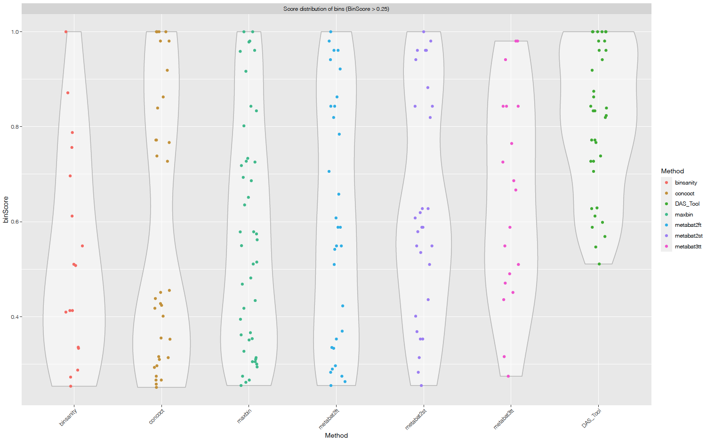

```{r xaringan-logo1, echo=FALSE}
library(xaringan)
library(xaringanExtra)
library(emo)
library(knitr)
```

```{css, echo = FALSE}
.huge .remark-code { /*Change made here*/
  font-size: 150% !important;
}
.tiny .remark-code { /*Change made here*/
  font-size: 20% !important;
}

```

```{r setup commen, include=FALSE}
knitr::opts_chunk$set(comment="")
```

```{css, echo = FALSE}
.huge .remark-code { /*Change made here*/
  font-size: 150% !important;
}
.tiny .remark-code { /*Change made here*/
  font-size: 60% !important;
}
```

```{r update1, eval = FALSE, echo=FALSE}
xaringan::inf_mr()
```

```{r update, eval = FALSE, echo=FALSE}
xaringan::inf_mr()
```

```{r xaringan-tile-view, echo=FALSE}
xaringanExtra::use_tile_view()
```

```{r xaringanExtra-clipboard, echo=FALSE}
htmltools::tagList(
  xaringanExtra::use_clipboard(
    button_text = "<i class=\"fa fa-clipboard\"></i>",
    success_text = "<i class=\"fa fa-check\" style=\"color: #90BE6D\"></i>",
    error_text = "<i class=\"fa fa-times-circle\" style=\"color: #F94144\"></i>"
  ),
  rmarkdown::html_dependency_font_awesome()
)
```

```{r xaringan-extra-styles, echo=FALSE}
xaringanExtra::use_extra_styles(
  hover_code_line = TRUE,         #<<
  mute_unhighlighted_code = TRUE  #<<
)
```

---
class: middle center bg-main1 hide_logo

# Remember that...

We have an hexagon logo for using in our presentations


<font size="2"> I will send you the file in an email </font>

---
class: middle, inverse

# Part I: PhD. Results

---
## DNA EXTRACTION 

.center[]

--

.center[Finally <font size="7"> **WE HAVE DNA** </font>]

---

## Protocol

```{r dna extraction, echo=FALSE, out.width="120%", out.height="120%", fig.align='center'}

```
---

# And Then...

```{r ggplot analises, echo=FALSE, out.width="100%", fig.align='center'}

```

---

# Now...

**Waiting for the results**


.center[]

---
class: middle, inverse

# Part II: Squeezing the master's results

---

## 2nd Paper - Binning

This paper was rejected the last year, so I´m remaking the analysis and I will change the aim. Also I invited **Victor** to help me!
The pipeline used <font size="5">[**here**](https://github.com/khidalgo85/Binning) </font>

.center[]

---

## Which is the minimum information for reporting MAGs?

```{r paper, echo=FALSE, out.width="90%", out.height="90%", fig.align='center'}

```

---

```{r paper2, echo=FALSE, out.width="90%", out.height="90%", fig.align='center'}

```

---

```{r paper3, echo=FALSE, out.width="90%", out.height="90%", fig.align='center'}

```

---
class: middle, inverse


# Some ready analysis and results

---

## How Many High-Quality Bins I recovered? 

After the dereplication stage (*DAS_Tool*)(contamination <5%)

.center[<font size="20"> 23!! </font>]

```{r dastool quality, echo=FALSE, out.width="90%", out.height="90%", fig.align='center'}

```

---

Other graph...

```{r dastool scores, echo=FALSE, out.width="100%", out.height="100%", fig.align='center'}

```

---

## And the completness and contamination?

```{r checkm, echo=FALSE, out.width="90%", out.height="90%", fig.align='center'}
knitr::include_graphics("imgs/checkm.png")
```

---

## Could I improve my bins?

Yes, with RefineM, MAGpurify or MAGpurify2 tools.

I tried with RefineM and MAGpurify but I got an error! 😞

I'm going to try again and to read about the errors.

---

## How abudant is each MAG in the samples?

```{r barchart, echo=FALSE, out.width="90%", out.height="90%", fig.align='center'}

```

---

## Next Steps

* Refine
* Taxonomic Annotation (16S, other markers, automatic-GTDB)
* Functional Annotation (EggNog, KEGG, DRAM)
* Phylogeny (Nat)
* Networks
* Flux Balance?

A lot of work!! 

.center[]

---
class: middle, inverse

## GRACIAS!

```{r povo, echo=FALSE, out.width="90%", out.height="90%", fig.align='center'}

```


